<!-- Generated by `python -m people_ai.metadata.render_docs` from metadata/tables.yaml, metadata/facts.yaml and metadata/schema_doc_template.md. Edit those, not this file. -->

# Synthetic Talent Lifecycle Schema

The data model for layer 1. It covers Acme Corp, a fictional company, from **2021-01-01 to 2025-12-31**: recruiting funnel, hire, internal moves, promotions, leave, exit, pay, ratings, engagement, and who may see what.

**How this document is made.** It is generated from three files in `metadata/`, and every number refers to `SEED = 42`:

- `tables.yaml` describes every table and column (section 3). Tests check each structural claim against the data: columns, types, NULLs, keys, allowed values, formats, ranges and references.
- `facts.yaml` holds every other number quoted here, each with the SQL that produces it and a confirmed value. Tests fail if the data drifts from it.
- `schema_doc_template.md` holds this narrative.

Row counts and value counts in section 3 are read from the data when the doc is rendered. Don't edit this file by hand: change `metadata/` and run `python -m people_ai.metadata.render_docs`.

No real person is represented. Names come from Faker. Emails use `example.com` for candidates and `acme.example` for employees, and phone numbers use the fictional 555-01XX range.

## 1. Conventions that matter for every query

| Rule | What it means in SQL |
|---|---|
| **Events are truth** | `employment_event` is the source. An employee's state on date D is their latest event with `effective_date <= D`. `employee_snapshot_monthly` is only a month-end copy of that; tests prove they match row for row. |
| **Effective dating** | `valid_from` and `valid_to` are inclusive. An open-ended row has `valid_to = 9999-12-31`. Join on id **and** date, e.g. `on o.org_unit_id = e.org_unit_id and D between o.valid_from and o.valid_to`. |
| **Effective date = first day of the new state** | A `termination` dated D means the person is not employed on D; their last working day is D-1. Role grants end on D-1 too. |
| **One event per employee per day** | Same-day changes merge into one row holding the end-of-day state. The more important type wins: termination > hire/rehire > transfer > promotion > job_change/leave > manager_change. |
| **Rehires keep their `employee_id`** | A boomerang's history is one timeline: hire … termination … rehire. |
| **Nothing exists after END** | A person with an accepted offer is **not** an employee until their start date. At END there are 174 open reqs (23 not yet approved), 802 applications in process, 74 accepted offers starting in 2026, and 26 offers awaiting a decision. Only planned dates (`target_start_date`, `offer.start_date`) may fall after END. |
| **History before 2021 is collapsed** | The 3,102 people employed on 2021-01-01 have one `hire` event (`event_reason = 'initial_load'`) at their real hire date, carrying their state as of 2021-01-01. Their comp row is dated the same way, and their manager grants start on 2021-01-01. Only analyze dynamics from 2021 on. |
| **`application.candidate_type` is the truth about who applied** | `external`, `internal` (current employee) or `boomerang` (former employee). A candidate row can carry both `internal_employee_id` and `former_employee_id` if the same person applied both ways over time. |

## 2. Entity map

Each line connects a referenced table (left) to a table that points at it (right); the label names the pointing columns.

```mermaid
erDiagram
  dim_org_unit ||--o{ dim_org_unit : "parent_org_unit_id"
  dim_job ||--o{ dim_comp_band : "job_id"
  dim_location ||--o{ dim_comp_band : "location_id"
  dim_org_unit ||--o{ headcount_plan : "org_unit_id"
  dim_org_unit ||--o{ requisition : "org_unit_id"
  dim_job ||--o{ requisition : "job_id"
  dim_location ||--o{ requisition : "location_id"
  employee ||--o{ requisition : "hiring_manager_employee_id, recruiter_employee_id, backfill_for_employee_id"
  dim_location ||--o{ candidate : "location_id"
  employee ||--o{ candidate : "internal_employee_id, former_employee_id"
  candidate ||--o{ application : "candidate_id"
  requisition ||--o{ application : "req_id"
  application ||--o{ application_stage_event : "application_id"
  application ||--o{ interview_scorecard : "application_id"
  employee ||--o{ interview_scorecard : "interviewer_employee_id"
  application ||--o{ offer : "application_id"
  dim_job ||--o{ offer : "job_id"
  dim_location ||--o{ offer : "location_id"
  employee ||--o{ employment_event : "employee_id, manager_employee_id"
  dim_org_unit ||--o{ employment_event : "org_unit_id"
  dim_job ||--o{ employment_event : "job_id"
  dim_location ||--o{ employment_event : "location_id"
  application ||--o{ employment_event : "application_id"
  employee ||--o{ employee_snapshot_monthly : "employee_id, manager_employee_id"
  dim_org_unit ||--o{ employee_snapshot_monthly : "org_unit_id"
  dim_job ||--o{ employee_snapshot_monthly : "job_id"
  dim_location ||--o{ employee_snapshot_monthly : "location_id"
  employee ||--o{ compensation : "employee_id"
  employee ||--o{ performance_rating : "employee_id, manager_employee_id_at_cycle"
  employee ||--o{ termination : "employee_id, last_manager_employee_id"
  dim_org_unit ||--o{ termination : "last_org_unit_id"
  dim_job ||--o{ termination : "last_job_id"
  employee ||--o{ engagement_response : "employee_id, manager_employee_id"
  dim_org_unit ||--o{ engagement_response : "org_unit_id"
  employee ||--o{ user_role : "user_id"
  dim_org_unit ||--o{ user_role : "scope_org_unit_id"
  employee ||--o{ demo_user : "user_id"
  dim_org_unit ||--o{ demo_user : "scope_org_unit_id"
```

## 3. Tables

Time kinds used below:

- **static:** No time dimension, or the row describes something that never changes.
- **effective_dated:** Versions with valid_from and valid_to (inclusive). Join on the id and the date.
- **event_log:** One row per change. State on date D is the latest row with a date on or before D.
- **snapshot:** State copied at fixed dates, derived from an event log.
- **periodic:** One row per cycle (survey, rating cycle, plan quarter).
- **lifecycle:** One row per record, with milestone dates filled in as it progresses.

Sensitivity levels, the data classes layer 3 authorizes:

- **reference:** Non-personal reference data: calendar, jobs, locations, pay bands, org structure, plans.
- **people:** Identifies employees or describes their employment history.
- **compensation:** Individual pay. Aggregates for everyone in scope; individual rows only for a manager's direct reports and an HRBP's subtree.
- **performance:** Individual ratings. Same rule as compensation.
- **engagement:** Survey answers. Never shown individually; aggregates suppressed below 5 respondents.
- **recruiting:** Requisitions, applications, interview outcomes and offers.
- **candidate_pii:** Candidate names and contact details. Recruiters and people analytics only.
- **access_control:** Who may see what.

### Dimensions and plans

#### `dim_date`

Calendar. Fiscal year and quarter equal the calendar year and quarter.

- **Grain:** one row per day from 2014-01-01 to 2025-12-31 (4,383 rows)
- **Keys:** primary key `date`
- **Time:** static. No time dimension, or the row describes something that never changes.
- **Sensitivity:** reference

| column | type | meaning |
|---|---|---|
| `date` | DATE | Calendar day. Range 2014-01-01 to 2025-12-31. |
| `date_key` | BIGINT | The date as yyyymmdd. Range 20140101 to 20251231. |
| `fiscal_year` | BIGINT | Calendar year. Range 2014 to 2025. |
| `fiscal_quarter` | BIGINT | Calendar quarter. Range 1 to 4. |
| `month` | BIGINT | Month number. Range 1 to 12. |
| `day_of_week` | BIGINT | ISO day of week, 1 = Monday. Range 1 to 7. |
| `is_month_end` | BOOLEAN | Last day of the month. |
| `is_quarter_end` | BOOLEAN | Last day of a quarter. |
| `is_year_end` | BOOLEAN | December 31. |

#### `dim_org_unit`

The org tree, effective dated. A unit keeps its id across versions; only its parent changes.

- **Grain:** one row per org unit version (67 rows)
- **Keys:** primary key `org_unit_id`, `valid_from`
- **Time:** effective_dated. Versions with valid_from and valid_to (inclusive). Join on the id and the date.
- **Sensitivity:** reference

Rules:
- Always join on `org_unit_id` and the date: `D between valid_from and valid_to`. Joining on id alone double counts units that moved.
- Reorg 1 on 2023-04-01 moves team 19 (App Experience) from Mobile to Growth. Reorg 2 on 2024-09-01 creates Applied AI (64) and moves teams 49 and 50 under it.

| column | type | meaning |
|---|---|---|
| `org_unit_id` | BIGINT | Stable id of the unit. |
| `org_unit_name` | VARCHAR | Unique name, e.g. Checkout. |
| `parent_org_unit_id` | BIGINT | Parent during this version. NULL means the company itself (top of the tree). References `dim_org_unit.org_unit_id`. |
| `org_level` | BIGINT | 1 company, 2 division, 3 org, 4 team. Range 1 to 4. |
| `valid_from` | DATE | First day this version applies. Original units start 2014-01-01. Range 2014-01-01 to 2025-12-31. |
| `valid_to` | DATE | Last day this version applies; 9999-12-31 while current. Range 2014-01-01 to 9999-12-31. |

#### `dim_location`

Office locations.

- **Grain:** one row per location (8 rows)
- **Keys:** primary key `location_id`
- **Time:** static. No time dimension, or the row describes something that never changes.
- **Sensitivity:** reference

| column | type | meaning |
|---|---|---|
| `location_id` | BIGINT | Location id. |
| `city` | VARCHAR | City. Values: `Seattle` 1 · `San Diego` 1 · `Austin` 1 · `Toronto` 1 · `Dublin` 1 · `London` 1 · `Bangalore` 1 · `Tokyo` 1. |
| `country` | VARCHAR | Country code. Values: `US` 3 · `CA` 1 · `IE` 1 · `UK` 1 · `IN` 1 · `JP` 1. |
| `region` | VARCHAR | Region. Values: `AMER` 4 · `EMEA` 2 · `APAC` 2. |
| `cost_of_living_index` | DOUBLE | Multiplier applied to pay bands (Austin = 1.0). Range 0.4 to 1.3. |

#### `dim_job`

Job catalog: family, track and level.

- **Grain:** one row per job (91 rows)
- **Keys:** primary key `job_id`
- **Time:** static. No time dimension, or the row describes something that never changes.
- **Sensitivity:** reference

Rules:
- IC levels 3-7 run Associate, (none), Senior, Staff, Principal. Manager levels 6-9 run Manager, Senior Manager, Director, VP. The CEO is level 10.

| column | type | meaning |
|---|---|---|
| `job_id` | BIGINT | Job id. |
| `job_family` | VARCHAR | Job family. Values: `Engineering` 9 · `Data` 9 · `Product` 9 · `Design` 9 · `Sales` 9 · `Marketing` 9 · `Customer Success` 9 · `People` 9 · `Finance` 9 · `Legal` 9 · `Executive` 1. |
| `job_track` | VARCHAR | IC = individual contributor, M = people manager, E = executive (CEO). Values: `IC` 50 · `M` 40 · `E` 1. |
| `job_level` | BIGINT | Level. IC and M overlap at 6-7. Range 3 to 10. |
| `job_title` | VARCHAR | Title, e.g. Senior Software Engineer or Director, Data Science. |
| `is_manager_role` | BOOLEAN | True for the M and E tracks. |

#### `dim_comp_band`

Pay bands per job and location, one version per calendar year.

- **Grain:** one row per job, location and year (3,640 rows)
- **Keys:** primary key `job_id`, `location_id`, `valid_from`
- **Time:** effective_dated. Versions with valid_from and valid_to (inclusive). Join on the id and the date.
- **Sensitivity:** reference

Rules:
- min = 0.8 x mid and max = 1.2 x mid. Mid rises 3.5% a year; 2024 adds a one-time market jump of +12% for Data and +6% for Engineering.
- Compa-ratio on date D = base salary on D / mid_salary of the band valid on D for the employee's job and location on D.

| column | type | meaning |
|---|---|---|
| `job_id` | BIGINT | Job. References `dim_job.job_id`. |
| `location_id` | BIGINT | Location. References `dim_location.location_id`. |
| `valid_from` | DATE | January 1 of the band year. Range 2021-01-01 to 2025-01-01. |
| `valid_to` | DATE | December 31 of the band year; 9999-12-31 for the latest year. Range 2021-12-31 to 9999-12-31. |
| `min_salary` | BIGINT | Band minimum. |
| `mid_salary` | BIGINT | Band midpoint. |
| `max_salary` | BIGINT | Band maximum. |
| `currency` | VARCHAR | Always USD. Values: `USD` 3,640. |

#### `headcount_plan`

Planned headcount per level-3 org and quarter.

- **Grain:** one row per org and quarter end (266 rows)
- **Keys:** primary key `org_unit_id`, `quarter_end`
- **Time:** periodic. One row per cycle (survey, rating cycle, plan quarter).
- **Sensitivity:** reference

Rules:
- Set on January 1 and re-set on each reorg date for the remaining quarters of that year.
- Compare with actual headcount rolled up using the org tree valid on quarter_end.

| column | type | meaning |
|---|---|---|
| `org_unit_id` | BIGINT | Level-3 org. References `dim_org_unit.org_unit_id`. |
| `quarter_end` | DATE | Last day of the quarter. Range 2021-03-31 to 2025-12-31. |
| `fiscal_year` | BIGINT | Plan year. Range 2021 to 2025. |
| `fiscal_quarter` | BIGINT | Plan quarter. Range 1 to 4. |
| `planned_headcount` | BIGINT | Planned active headcount at quarter end. |
| `plan_version_date` | DATE | When this plan value was set: January 1 or a reorg date. Range 2021-01-01 to 2025-12-31. |

### Recruiting (ATS)

#### `requisition`

An approved opening to hire one person into a team.

- **Grain:** one row per opening (4,738 rows)
- **Keys:** primary key `req_id`
- **Time:** lifecycle. One row per record, with milestone dates filled in as it progresses.
- **Sensitivity:** recruiting

Rules:
- Time to fill = days from approved_date to closed_date, for close_reason = 'filled' only.
- Every backfill points at a termination dated on or before opened_date.

| column | type | meaning |
|---|---|---|
| `req_id` | BIGINT | Requisition id. |
| `org_unit_id` | BIGINT | Hiring team (level 4). References `dim_org_unit.org_unit_id`. |
| `job_id` | BIGINT | The role. Always an IC job. References `dim_job.job_id`. |
| `location_id` | BIGINT | Where the role sits. References `dim_location.location_id`. |
| `hiring_manager_employee_id` | BIGINT | Hiring manager when the req opened. References `employee.employee_id`. |
| `recruiter_employee_id` | BIGINT | Recruiter from the Talent Acquisition team. References `employee.employee_id`. |
| `headcount_type` | VARCHAR | new = growth, backfill = replaces someone who left. Values: `new` 2,907 · `backfill` 1,831. |
| `backfill_for_employee_id` | BIGINT | The terminated employee being replaced. NULL means a growth req (headcount_type = new). References `employee.employee_id`. |
| `opened_date` | DATE | Req opened. Range 2021-01-01 to 2025-12-31. |
| `approved_date` | DATE | Approved; sourcing starts this day. NULL means opened in the last days of 2025 and not yet approved at END. Range 2021-01-01 to 2025-12-31. |
| `target_start_date` | DATE | Planned start date. A plan, so it may fall after END. Range 2021-01-01 to 2026-12-31. |
| `closed_date` | DATE | Closed: the day an offer was accepted, or the day it was cancelled. NULL means still open at END. Range 2021-01-01 to 2025-12-31. |
| `close_reason` | VARCHAR | cancelled_no_hire = three sourcing rounds without a hire. NULL means still open at END. Values: `filled` 4,226 · `cancelled_no_hire` 113 · `cancelled_business_change` 101 · `cancelled_hiring_freeze` 124. |

#### `candidate`

A person in the recruiting system. The same candidate can apply to several reqs.

- **Grain:** one row per person (187,360 rows)
- **Keys:** primary key `candidate_id`
- **Time:** static. No time dimension, or the row describes something that never changes.
- **Sensitivity:** recruiting

| column | type | meaning |
|---|---|---|
| `candidate_id` | BIGINT | Candidate id. |
| `first_name` | VARCHAR | Fake first name. Sensitivity: **candidate_pii**. |
| `last_name` | VARCHAR | Fake last name. Sensitivity: **candidate_pii**. |
| `email` | VARCHAR | Fake email. Internal applicants keep their work email. Format `[a-z]*\.[a-z]*\.[0-9]+@(example\.com\|acme\.example)`. Sensitivity: **candidate_pii**. |
| `phone` | VARCHAR | Fictional 555-01XX number. Format `\+1-[0-9]{3}-555-01[0-9]{2}`. Sensitivity: **candidate_pii**. |
| `location_id` | BIGINT | Where the candidate lives. References `dim_location.location_id`. |
| `years_experience` | BIGINT | Years of experience. Range 0 to 20. |
| `current_company` | VARCHAR | Fake current employer; Acme Corp for internal applicants. |
| `highest_degree` | VARCHAR | Highest education listed. Values: `Bachelor's` 102,955 · `Master's` 56,439 · `PhD` 9,364 · `Bootcamp / certificate` 9,278 · `None listed` 9,324. |
| `skills` | VARCHAR | Semicolon-separated skills. Ground truth for resume_text. |
| `internal_employee_id` | BIGINT | Employee id when the candidate applied as a current employee. NULL means never applied while employed at Acme. References `employee.employee_id`. |
| `former_employee_id` | BIGINT | Employee id when the candidate applied as a former employee (boomerang). NULL means never applied as a former employee. References `employee.employee_id`. |
| `created_date` | DATE | First application date. Range 2021-01-01 to 2025-12-31. |
| `resume_text` | VARCHAR | Resume text. Placeholder: NULL until the text step runs (section 9). Sensitivity: **candidate_pii**. |

#### `application`

One candidate applying to one req.

- **Grain:** one row per candidate per req (215,061 rows)
- **Keys:** primary key `application_id`
- **Time:** lifecycle. One row per record, with milestone dates filled in as it progresses.
- **Sensitivity:** recruiting

Rules:
- candidate_type is the truth about who applied; candidate.internal_employee_id and former_employee_id only say the person applied that way at some point.
- For channel analysis of external sourcing, filter candidate_type = 'external'; internal applicants convert far better.

| column | type | meaning |
|---|---|---|
| `application_id` | BIGINT | Application id. |
| `candidate_id` | BIGINT | Who applied. References `candidate.candidate_id`. |
| `req_id` | BIGINT | What they applied to. References `requisition.req_id`. |
| `candidate_type` | VARCHAR | internal = current employee, boomerang = former employee. Values: `external` 204,509 · `internal` 7,550 · `boomerang` 3,002. |
| `source_channel` | VARCHAR | How the application arrived; internal_mobility for internal applicants. Values: `inbound` 93,281 · `referral` 37,951 · `sourced` 45,388 · `agency` 10,113 · `campus` 20,778 · `internal_mobility` 7,550. |
| `applied_date` | DATE | Applied; on or after the req's approved_date. Range 2021-01-01 to 2025-12-31. |
| `current_stage` | VARCHAR | Last stage entered. Values: `applied` 134,047 · `recruiter_screen` 40,523 · `hiring_manager_screen` 21,531 · `onsite` 13,395 · `offer` 5,565. |
| `current_stage_date` | DATE | When current_stage was entered. Range 2021-01-01 to 2025-12-31. |
| `final_disposition` | VARCHAR | Outcome; in_process only for applications still open at END. Values: `hired` 4,226 · `rejected` 195,136 · `withdrawn` 14,897 · `in_process` 802. |
| `disposition_date` | DATE | When the outcome was decided. NULL means still in process at END. Range 2021-01-01 to 2025-12-31. |
| `disposition_reason` | VARCHAR | Why it ended without a hire. NULL means hired, or still in process. Values: `rejected_at_applied` 119,693 · `rejected_at_recruiter_screen` 32,499 · `rejected_at_hiring_manager_screen` 15,266 · `rejected_at_onsite` 7,462 · `candidate_withdrew` 13,551 · `declined_offer` 1,311 · `position_filled` 18,946 · `req_cancelled` 1,245 · `not_selected` 25 · `candidate_left_company` 35. |

#### `application_stage_event`

Each stage an application entered, in order: applied (resume review), recruiter_screen, hiring_manager_screen, onsite, offer.

- **Grain:** one row per application per stage entered (361,091 rows)
- **Keys:** primary key `stage_event_id`
- **Time:** event_log. One row per change. State on date D is the latest row with a date on or before D.
- **Sensitivity:** recruiting

Rules:
- Conversion at a stage = rows with outcome advance (or accept at offer) / rows with a non-NULL outcome.

| column | type | meaning |
|---|---|---|
| `stage_event_id` | BIGINT | Stage event id. |
| `application_id` | BIGINT | Application. References `application.application_id`. |
| `stage` | VARCHAR | Stage. Values: `applied` 215,061 · `recruiter_screen` 81,014 · `hiring_manager_screen` 40,491 · `onsite` 18,960 · `offer` 5,565. |
| `entered_date` | DATE | Entered the stage. Range 2021-01-01 to 2025-12-31. |
| `exited_date` | DATE | Left the stage. NULL means the stage was still open at END. Range 2021-01-01 to 2025-12-31. |
| `outcome` | VARCHAR | accept and decline only occur at the offer stage. NULL means the stage was still open at END. Values: `advance` 147,322 · `reject` 193,847 · `withdraw` 13,585 · `accept` 4,226 · `decline` 1,311. |

#### `interview_scorecard`

One interviewer's verdict on one interview.

- **Grain:** one row per interviewer per interview stage (164,490 rows)
- **Keys:** primary key `scorecard_id`
- **Time:** event_log. One row per change. State on date D is the latest row with a date on or before D.
- **Sensitivity:** recruiting

Rules:
- Recruiter screen: the recruiter. Hiring manager screen: the hiring manager. Onsite: the hiring manager plus up to 3 team members.
- Recommendations mostly agree with the stage outcome, with deliberate disagreements.

| column | type | meaning |
|---|---|---|
| `scorecard_id` | BIGINT | Scorecard id. |
| `application_id` | BIGINT | Application. References `application.application_id`. |
| `stage` | VARCHAR | Interview stage. Values: `recruiter_screen` 72,988 · `hiring_manager_screen` 34,226 · `onsite` 57,276. |
| `interviewer_employee_id` | BIGINT | Interviewer; always active on submitted_date. References `employee.employee_id`. |
| `submitted_date` | DATE | Submitted; the day the stage was decided. Range 2021-01-01 to 2025-12-31. |
| `recommendation` | VARCHAR | Interviewer's recommendation. Values: `strong_yes` 30,603 · `yes` 59,241 · `no` 51,296 · `strong_no` 23,350. |
| `feedback_text` | VARCHAR | Written interview feedback. Placeholder: NULL until the text step runs (section 9). |

#### `offer`

An offer extended to an application that passed onsite.

- **Grain:** one row per offer (at most one per application) (5,565 rows)
- **Keys:** primary key `offer_id`; unique `application_id`
- **Time:** lifecycle. One row per record, with milestone dates filled in as it progresses.
- **Sensitivity:** recruiting

Rules:
- An accepted offer becomes an employee only on start_date. Offers starting after END never appear in HRIS.

| column | type | meaning |
|---|---|---|
| `offer_id` | BIGINT | Offer id. |
| `application_id` | BIGINT | Application. References `application.application_id`. |
| `extended_date` | DATE | Offer extended. Range 2021-01-01 to 2025-12-31. |
| `job_id` | BIGINT | Offered job. References `dim_job.job_id`. |
| `job_level` | BIGINT | Offered level. Range 3 to 7. |
| `location_id` | BIGINT | Offered location. References `dim_location.location_id`. |
| `base_salary_offered` | BIGINT | Offered base salary (USD). Sensitivity: **compensation**. |
| `decision` | VARCHAR | Candidate's decision. NULL means awaiting a decision at END. Values: `accepted` 4,226 · `declined` 1,313. |
| `decision_date` | DATE | Decided. NULL means awaiting a decision at END. Range 2021-01-01 to 2025-12-31. |
| `decline_reason` | VARCHAR | Why it was declined; left_company = an internal candidate left before deciding. NULL means accepted or undecided. Values: `comp` 555 · `competing_offer` 349 · `role_scope` 193 · `location` 91 · `personal` 123 · `left_company` 2. |
| `competing_offer_flag` | BOOLEAN | Candidate reported another offer. |
| `start_date` | DATE | Agreed start date. May fall after END. NULL means declined or undecided. Range 2021-01-01 to 2026-12-31. |

### Employees (HRIS)

#### `employee`

Everyone ever employed. Identity only: all state (team, job, manager, status) lives in employment_event.

- **Grain:** one row per person ever employed (6,518 rows)
- **Keys:** primary key `employee_id`
- **Time:** static. No time dimension, or the row describes something that never changes.
- **Sensitivity:** people

Rules:
- Rehires keep their employee_id; their history is one timeline in employment_event.

| column | type | meaning |
|---|---|---|
| `employee_id` | BIGINT | Employee id, also user_id in user_role. |
| `first_name` | VARCHAR | Fake first name. |
| `last_name` | VARCHAR | Fake last name. |
| `legal_name` | VARCHAR | First and last name. Not unique. |
| `work_email` | VARCHAR | Fake work email. Format `[a-z]*\.[a-z]*\.[0-9]+@acme\.example`. |
| `original_hire_date` | DATE | First hire. Range 2014-01-01 to 2025-12-31. |
| `most_recent_hire_date` | DATE | Latest hire or rehire; tenure counts from here. Range 2014-01-01 to 2025-12-31. |
| `is_rehire` | BOOLEAN | Has at least one rehire event. |

#### `employment_event`

The source of truth for employment. Every hire, rehire, transfer, promotion, job change, manager change, leave and termination is a row.

- **Grain:** one row per change, at most one per employee per day (14,965 rows)
- **Keys:** primary key `event_id`; unique `employee_id`, `effective_date`
- **Time:** event_log. One row per change. State on date D is the latest row with a date on or before D.
- **Sensitivity:** people

Rules:
- State on date D = the employee's latest event with effective_date <= D. The row holds the full state after the change.
- effective_date is the first day of the new state: a termination dated D means not employed on D.
- Same-day changes merge into one row; the more important type wins (termination > hire/rehire > transfer > promotion > job_change/leave > manager_change).
- First event is always hire. After a termination the only next event is rehire. leave_return only follows leave.
- Everyone employed on 2021-01-01 has one hire event (event_reason = initial_load) at their real hire date, carrying their 2021-01-01 state. Analyze dynamics from 2021 on.
- A reorg moves teams in dim_org_unit; team members get no event.

| column | type | meaning |
|---|---|---|
| `event_id` | BIGINT | Chronological event id. |
| `employee_id` | BIGINT | Employee. References `employee.employee_id`. |
| `event_type` | VARCHAR | What changed. Values: `hire` 6,518 · `rehire` 206 · `transfer` 1,105 · `promotion` 1,626 · `job_change` 131 · `manager_change` 2,064 · `leave_start` 562 · `leave_return` 519 · `termination` 2,234. |
| `effective_date` | DATE | First day the new state applies. Range 2014-01-01 to 2025-12-31. |
| `org_unit_id` | BIGINT | Unit after the event: a team, or an org/division for leaders. References `dim_org_unit.org_unit_id`. |
| `job_id` | BIGINT | Job after the event. References `dim_job.job_id`. |
| `job_level` | BIGINT | Level after the event. Range 3 to 10. |
| `location_id` | BIGINT | Location after the event. References `dim_location.location_id`. |
| `manager_employee_id` | BIGINT | Manager after the event. NULL means the CEO. References `employee.employee_id`. |
| `employment_status` | VARCHAR | Status after the event. Values: `active` 12,154 · `leave` 577 · `terminated` 2,234. |
| `event_reason` | VARCHAR | hire: initial_load. transfer: lateral_move, internal_application. promotion and job_change: cycle, succession, new_people_manager, reorg. manager_change: manager_departed, reorg. termination: the exit reason. NULL means no reason recorded (external hires, rehires, leaves). Values: `initial_load` 3,102 · `lateral_move` 575 · `internal_application` 530 · `cycle` 1,403 · `succession` 272 · `new_people_manager` 81 · `reorg` 3 · `manager_departed` 2,062 · `career_growth` 444 · `comp` 503 · `manager` 175 · `relocation` 156 · `personal` 209 · `competing_offer` 286 · `performance` 229 · `misconduct` 52 · `restructuring` 124 · `reduction_in_force` 56. |
| `application_id` | BIGINT | The application that led to this hire or move: the HRIS-to-ATS join. NULL means not a hire, rehire or internal-application transfer. References `application.application_id`. |

#### `employee_snapshot_monthly`

Month-end state of everyone active or on leave, derived from employment_event. A convenience copy: if it disagrees with events, the snapshot is wrong.

- **Grain:** one row per employee per month end (225,579 rows)
- **Keys:** primary key `snapshot_date`, `employee_id`
- **Time:** snapshot. State copied at fixed dates, derived from an event log.
- **Sensitivity:** people

Rules:
- Headcount excludes employment_status = 'leave' unless a question asks to include it.

| column | type | meaning |
|---|---|---|
| `snapshot_date` | DATE | Month end. Range 2021-01-31 to 2025-12-31. |
| `employee_id` | BIGINT | Employee. References `employee.employee_id`. |
| `org_unit_id` | BIGINT | Unit on snapshot_date. References `dim_org_unit.org_unit_id`. |
| `job_id` | BIGINT | Job on snapshot_date. References `dim_job.job_id`. |
| `job_level` | BIGINT | Level on snapshot_date. Range 3 to 10. |
| `location_id` | BIGINT | Location on snapshot_date. References `dim_location.location_id`. |
| `manager_employee_id` | BIGINT | Manager on snapshot_date. NULL means the CEO. References `employee.employee_id`. |
| `employment_status` | VARCHAR | Status on snapshot_date. Values: `active` 223,982 · `leave` 1,597. |
| `tenure_months` | BIGINT | Months since most recent hire or rehire. Range 0 to 200. |

#### `compensation`

Pay changes.

- **Grain:** one row per pay change, at most one per employee per day (25,564 rows)
- **Keys:** primary key `employee_id`, `effective_date`
- **Time:** event_log. One row per change. State on date D is the latest row with a date on or before D.
- **Sensitivity:** compensation

Rules:
- Pay on date D = the latest row with effective_date <= D.
- Merit increases land every March 1; promotion raises on the promotion date.

| column | type | meaning |
|---|---|---|
| `employee_id` | BIGINT | Employee. References `employee.employee_id`. |
| `effective_date` | DATE | First day this pay applies. Range 2014-01-01 to 2025-12-31. |
| `base_salary` | BIGINT | Annual base salary (USD). |
| `currency` | VARCHAR | Always USD. Values: `USD` 25,564. |
| `bonus_target_pct` | DOUBLE | Bonus target as a fraction of base; Sales adds 0.25 variable. Range 0 to 1. |
| `equity_grant_value` | BIGINT | Equity granted with this change (USD); 0 when none. |
| `comp_change_reason` | VARCHAR | Why pay changed. Values: `hire` 6,518 · `rehire` 206 · `merit` 16,461 · `promotion` 1,626 · `transfer` 530 · `relocation` 92 · `job_change` 131. |

#### `performance_rating`

Twice-yearly performance ratings.

- **Grain:** one row per employee per rating cycle (36,404 rows)
- **Keys:** primary key `employee_id`, `cycle`
- **Time:** periodic. One row per cycle (survey, rating cycle, plan quarter).
- **Sensitivity:** performance

Rules:
- Only people employed on rating_date with at least 90 days of tenure are rated.

| column | type | meaning |
|---|---|---|
| `employee_id` | BIGINT | Employee. References `employee.employee_id`. |
| `cycle` | VARCHAR | Cycle, e.g. 2024H2. Format `[0-9]{4}H[12]`. |
| `rating_date` | DATE | June 30 or December 31. Range 2021-06-30 to 2025-12-31. |
| `rating` | BIGINT | 1 (lowest) to 5; roughly 3/12/55/22/8% of ratings. Range 1 to 5. |
| `calibrated_flag` | BOOLEAN | Always true in this dataset. Values: `true` 36,404. |
| `manager_employee_id_at_cycle` | BIGINT | Manager on rating_date. NULL means the CEO. References `employee.employee_id`. |

#### `termination`

Details of each exit. One row per termination event.

- **Grain:** one row per exit (a rehired person can have several) (2,234 rows)
- **Keys:** primary key `employee_id`, `termination_date`
- **Time:** event_log. One row per change. State on date D is the latest row with a date on or before D.
- **Sensitivity:** people

Rules:
- Voluntary attrition = voluntary terminations in the period / average month-end active headcount, annualized.
- Regretted attrition = voluntary terminations with regretted_flag = true.

| column | type | meaning |
|---|---|---|
| `employee_id` | BIGINT | Employee. References `employee.employee_id`. |
| `termination_date` | DATE | First day not employed. Range 2021-01-01 to 2025-12-31. |
| `termination_type` | VARCHAR | Who decided. Values: `voluntary` 1,773 · `involuntary` 461. |
| `exit_reason` | VARCHAR | Voluntary: career_growth, comp, manager, relocation, personal, competing_offer. Involuntary: performance, misconduct, restructuring, reduction_in_force (the 2023-02-15 layoff). Values: `career_growth` 444 · `comp` 503 · `manager` 175 · `relocation` 156 · `personal` 209 · `competing_offer` 286 · `performance` 229 · `misconduct` 52 · `restructuring` 124 · `reduction_in_force` 56. |
| `regretted_flag` | BOOLEAN | Voluntary and last_rating >= 4. |
| `rehire_eligible` | BOOLEAN | Voluntary and last_rating >= 3. |
| `last_org_unit_id` | BIGINT | Unit on the last working day. References `dim_org_unit.org_unit_id`. |
| `last_job_id` | BIGINT | Job on the last working day. References `dim_job.job_id`. |
| `last_job_level` | BIGINT | Level on the last working day. Range 3 to 10. |
| `last_manager_employee_id` | BIGINT | Manager on the last working day. Never NULL: the CEO does not leave in this dataset. References `employee.employee_id`. |
| `last_rating` | BIGINT | Latest rating before exit. Range 1 to 5. Sensitivity: **performance**. |
| `exit_interview_text` | VARCHAR | Exit interview notes. Placeholder: NULL until the text step runs (section 9). |

#### `engagement_response`

Annual engagement survey answers (October 15, about 74% response).

- **Grain:** one row per respondent per survey cycle (13,827 rows)
- **Keys:** primary key `response_id`; unique `survey_cycle`, `employee_id`
- **Time:** periodic. One row per cycle (survey, rating cycle, plan quarter).
- **Sensitivity:** engagement

Rules:
- Never show an individual response. Suppress any aggregate with fewer than 5 respondents.

| column | type | meaning |
|---|---|---|
| `response_id` | BIGINT | Response id. |
| `survey_cycle` | VARCHAR | Survey year. Format `[0-9]{4}`. |
| `response_date` | DATE | Survey date. Range 2021-10-15 to 2025-10-15. |
| `employee_id` | BIGINT | Respondent. Present for authorization testing; real survey tools hide it. References `employee.employee_id`. |
| `org_unit_id` | BIGINT | Respondent's unit on response_date. References `dim_org_unit.org_unit_id`. |
| `manager_employee_id` | BIGINT | Respondent's manager on response_date. NULL means the respondent is the CEO. References `employee.employee_id`. |
| `engagement_score` | DOUBLE | Overall engagement, 1 to 5. Range 1 to 5. |
| `manager_score` | DOUBLE | Rating of their manager, 1 to 5. Range 1 to 5. |
| `growth_score` | DOUBLE | Career growth, 1 to 5. Range 1 to 5. |
| `comment_theme` | VARCHAR | What the comment is about; none = no comment. Ground truth for comment_text. Values: `manager` 153 · `comp` 2,034 · `career_growth` 2,251 · `reorg` 228 · `workload` 1,541 · `tools` 1,545 · `team_positive` 1,534 · `mission_positive` 1,449 · `none` 3,092. |
| `comment_sentiment` | VARCHAR | Sentiment of the comment. NULL means no comment (comment_theme = none). Values: `negative` 7,752 · `positive` 2,983. |
| `comment_text` | VARCHAR | Free-text comment. Placeholder: NULL until the text step runs (section 9). |

### Governance

#### `user_role`

Effective-dated access grants. user_id is an employee_id.

- **Grain:** one row per grant interval (801 rows)
- **Keys:** unique `user_id`, `role`, `scope_org_unit_id`, `valid_from`
- **Time:** effective_dated. Versions with valid_from and valid_to (inclusive). Join on the id and the date.
- **Sensitivity:** access_control

Rules:
- manager: while the person has at least one direct report; scope is their whole reporting tree on the date.
- hrbp: exactly one per level-3 org at all times; scope is that org's subtree on the date.
- executive: division VPs (their division) and the CEO (the company); aggregates only, below team level.
- people_analytics: members of the People Analytics team; everything.
- A grant ends the day before the person leaves the position or the company, and the successor's starts that day. Leave does not suspend access.

| column | type | meaning |
|---|---|---|
| `user_id` | BIGINT | The employee holding the grant. References `employee.employee_id`. |
| `role` | VARCHAR | Role. Values: `manager` 727 · `hrbp` 32 · `executive` 6 · `people_analytics` 36. |
| `scope_type` | VARCHAR | How scope is resolved: manager, hrbp, executive, people_analytics respectively. Values: `reporting_tree` 727 · `org_subtree` 32 · `aggregate_subtree` 6 · `all` 36. |
| `scope_org_unit_id` | BIGINT | Root of the scope. NULL means role = manager: scope is people (the reporting tree), not an org unit. References `dim_org_unit.org_unit_id`. |
| `valid_from` | DATE | First day of the grant. Grants existing at START begin 2021-01-01. Range 2021-01-01 to 2025-12-31. |
| `valid_to` | DATE | Last day of the grant; 9999-12-31 while current. Range 2021-01-01 to 9999-12-31. |

#### `demo_user`

Stable personas for tests, evals and demos, valid on 2025-12-31. Look personas up by name; ids are only stable for one seed.

- **Grain:** one row per persona (10 rows)
- **Keys:** primary key `persona`
- **Time:** static. No time dimension, or the row describes something that never changes.
- **Sensitivity:** access_control

| column | type | meaning |
|---|---|---|
| `persona` | VARCHAR | Persona name. Values: `people_analytics` 1 · `hrbp_ai_platform` 1 · `executive_platform` 1 · `ceo` 1 · `manager_checkout_lead` 1 · `manager_team_19_lead` 1 · `manager_small_team` 1 · `former_manager` 1 · `ic_no_access` 1 · `planted_bad_manager` 1. |
| `user_id` | BIGINT | Employee id to act as. References `employee.employee_id`. |
| `role` | VARCHAR | Role on 2025-12-31. Values: `people_analytics` 1 · `hrbp` 1 · `executive` 2 · `manager` 3 · `none` 3. |
| `scope_org_unit_id` | BIGINT | Scope root for hrbp, executive and people_analytics. NULL means no org scope (a manager, or no role). References `dim_org_unit.org_unit_id`. |
| `description` | VARCHAR | What the persona is for. |

## 4. Organization

Acme Corp (1) has four divisions (2 to 5). Level-3 orgs as of END:

| division | orgs (id) |
|---|---|
| Consumer | Mobile 6, Growth 7, Payments 8 |
| Enterprise | Cloud Sales 9, Solutions 10, Partner 11 |
| Platform | Infrastructure 12, Data Platform 13, AI Platform 14, Security 15, Applied AI 64 |
| Corporate | People 16, Finance 17, Legal 18 |

- **Teams:** 45 teams with ids 19 to 63, in the order listed in `params.ORG_DESIGN` (for example Checkout 27, Talent Acquisition 54, HR Business Partners 55, People Analytics 56).
- **Reorg 1 (2023-04-01):** team **19, App Experience**, moves between orgs. Its parent is Mobile on 2023-03-31 and Growth on 2023-04-30. Team members get no event, because their team didn't change; only the team lead gets a `manager_change` (`reorg`).
- **Reorg 2 (2024-09-01):** AI Platform is split. A new org, **Applied AI (64)**, is created, and Applied ML 49, Evaluation 50 move under it. One of those teams' leads becomes its director (`promotion`, reason `reorg`). HRBP coverage and the headcount plan are re-based that day.

**Management chain:** CEO → division VP (level 9) → org director (8) → team lead (7) → line managers (6) → ICs.
- On 2025-12-31 the deepest chain is 5 hops, and the average span of control is 9.1.
- New hires go to the line manager with the fewest reports. When every line manager has 10, the best-rated eligible IC becomes a new line manager.
- When a manager leaves, the best-rated eligible direct report is promoted into the role (`succession`) and takes over the rest; if nobody fits, the reports move up a level.

## 5. Authorization rules (enforced in layer 3)

From PROJECT_PLAN:

| data class | manager | hrbp | executive | people_analytics |
|---|---|---|---|---|
| people (roster, events, headcount) | own reporting tree as of the date | org subtree as of the date | division subtree, aggregated below team level | all |
| compensation | individual rows for direct reports only; aggregates for the tree | individual rows in the subtree | aggregated | all |
| performance | individual rows for direct reports only | individual rows in the subtree | aggregated | all |
| engagement | aggregates only, suppressed below 5 respondents | same | same | same (never individual) |

**To decide in layer 3:** recruiting data is not covered by the plan yet. The proposed default:
- Hiring managers and recruiters see their own reqs and applicants.
- HRBPs see reqs in their org subtree.
- Executives see aggregates.
- people_analytics sees everything.
- Candidate contact details (`candidate_pii`) are visible to recruiters and people_analytics only.

**Demo personas** (`demo_user`) for tests and evals, valid on 2025-12-31. Look them up by persona name; ids are only stable for this seed.

| persona | user_id | role | scope_org_unit_id | what it is for |
|---|---|---|---|---|
| ceo | 1 | executive | 1 | Whole company, aggregated only |
| executive_platform | 4 | executive | 4 | Platform division, aggregated only |
| former_manager | 22 | none | NULL | Managed people before 2024, not today |
| hrbp_ai_platform | 3523 | hrbp | 14 | HRBP for AI Platform org subtree |
| ic_no_access | 28 | none | NULL | Individual contributor with no access rights |
| manager_checkout_lead | 617 | manager | NULL | Lead of Checkout team (S2 team) |
| manager_small_team | 2906 | manager | NULL | Line manager with 3-4 reports (suppression tests) |
| manager_team_19_lead | 25 | manager | NULL | Lead of the team moved in reorg 1 |
| people_analytics | 453 | people_analytics | 1 | Sees everything |
| planted_bad_manager | 618 | none | NULL | S2: low-quality line manager in Checkout, exited 2025-07-15 |

## 6. Headline numbers

Rates use average month-end active headcount for the year.

| year | active at year end | hires | rehires | internal moves | voluntary exits | involuntary exits | voluntary % | involuntary % | regretted share of voluntary % |
|---|---|---|---|---|---|---|---|---|---|
| 2021 | 3,267 | 519 | 15 | 84 | 268 | 72 | 8.6 | 2.3 | 30.6 |
| 2022 | 3,747 | 811 | 49 | 126 | 322 | 63 | 9.2 | 1.8 | 29.5 |
| 2023 | 3,855 | 536 | 36 | 96 | 340 | 127 | 9.0 | 3.4 | 40.9 |
| 2024 | 4,113 | 765 | 46 | 109 | 447 | 96 | 11.3 | 2.4 | 34.5 |
| 2025 | 4,462 | 785 | 60 | 115 | 396 | 103 | 9.2 | 2.4 | 37.1 |

Active headcount was 3,069 on 2021-01-31 and 4,462 on 2025-12-31; 6,518 people were employed at some point. Initial-load hire events are dated before 2021, so the hires column counts only real hires.

## 7. Planted signals: known answers for evals

These patterns are deliberate. Their parameters live under PLANTED SIGNALS in `params.py`, `tests/test_planted_signals.py` keeps them from disappearing, and the numbers below are verified facts.

**S1: Platform attrition rose in 2024.** This is the answer to "why did attrition rise in Platform in 2024?"

Voluntary attrition by division, %:

| division | 2023 | 2024 | 2025 |
|---|---|---|---|
| Consumer | 8.6 | 11.0 | 8.9 |
| Enterprise | 10.3 | 9.0 | 8.5 |
| Platform | 7.6 | 13.7 | 10.2 |
| Corporate | 11.3 | 9.9 | 8.5 |

- **Driver 1, market pay:** the 2024 band jump (+12% Data, +6% Engineering) left those families below band. Platform is mostly Data and Engineering; Consumer, which also employs many engineers, rose a little too.

| job family | 2023-06-30 | 2024-06-30 |
|---|---|---|
| Data | 1.0 | 0.91 |
| Engineering | 1.0 | 0.94 |
| Sales | 1.01 | 1.01 |

- **Driver 2, uncertainty:** extra flight risk in Platform from 2024-06-01 to 2025-03-31, around the AI Platform split (reorg 2).
- **Evidence in the survey:** Platform engagement fell in 2024 while other divisions held. Growth scores dropped too, `comment_theme = 'reorg'` appears, and exit reasons shift toward `competing_offer` and `comp`.

| division | 2023 | 2024 |
|---|---|---|
| Consumer | 3.73 | 3.69 |
| Enterprise | 3.76 | 3.72 |
| Platform | 3.73 | 3.22 |
| Corporate | 3.73 | 3.72 |

**S2: one bad manager.**
- **Who:** employee **618**, a line manager in Checkout (27).
- **Attrition:** their reports quit at a 65% annualized rate, against 9.5% company-wide, and 11 exits cite `manager`.
- **Engagement:** their average manager_score is 2.76, against 3.84 company-wide.
- **Outcome:** exited as involuntary / `performance` on 2025-07-15.

**S3: referrals convert and accept better.** External applicants only; internal applicants convert even better, so leaving them in inflates every channel.

| source | passes resume review % | accepts offer % |
|---|---|---|
| agency | 46.3 | 58.6 |
| campus | 28.2 | 70.0 |
| inbound | 26.4 | 72.5 |
| referral | 55.9 | 81.3 |
| sourced | 42.2 | 68.6 |

**S4: location effects in hiring.**
- In Bangalore, 56.4% of declined offers cite `comp`, against 34.3% elsewhere.
- London reqs take a median 70 days from approval to fill, against 57 elsewhere.

**S5: pay and performance drive who leaves.**

| last rating | voluntary | involuntary |
|---|---|---|
| 1 | 47 | 96 |
| 2 | 194 | 161 |
| 3 | 915 | 177 |
| 4 | 433 | 24 |
| 5 | 184 | 3 |

- 35% of voluntary exits were rated 4-5, against 32% of all ratings. High performers paid below band are the most likely to quit, which is why regretted attrition matters.
- 56% of involuntary exits were rated 1-2, against 13% of all ratings.

**S6: hiring freeze.** On 2023-01-15, 124 open growth reqs were cancelled (`cancelled_hiring_freeze`). No growth reqs opened from 2023-01-15 to 2023-03-31; backfills continued.

**S7: Enterprise restructuring.** On 2023-02-15, 56 Enterprise employees were exited with `exit_reason = 'reduction_in_force'`, weighted toward low ratings, and none were backfilled. This drives the 2023 involuntary spike in the headline table.

## 8. Known simplifications

- Everyone is full time. Pay is in USD. Bands change once a year.
- Lateral transfers and internal applications are for ICs only; people become managers only through succession or span growth.
- Growth reqs are opened to track a company headcount target, so hiring follows `params.GROWTH_BY_YEAR`.
- Recruiter and interviewer workloads are not capped.
- Engagement responses carry `employee_id` so authorization can be tested; a real survey vendor would not expose it.
- Pre-2021 history is collapsed (section 1).

## 9. Text columns (optional LLM step, not yet in PROJECT_PLAN)

These free-text columns are NULL today. Each sits next to structured ground truth, so text generated from that truth can later be evaluated, for example: "does the classifier recover the theme we planted?" A test fails as soon as one of them gets values, so this list can't go stale.

| column | generate from | lets you practice |
|---|---|---|
| `candidate.resume_text` | skills, years_experience, current_company, highest_degree, family of the jobs applied to | structured extraction, resume-to-job matching with embeddings, PII redaction, planted prompt-injection resumes |
| `interview_scorecard.feedback_text` | stage, recommendation, application outcome | summarization, checking a summary agrees with the hiring decision |
| `termination.exit_interview_text` | exit_reason, regretted_flag, last_rating | classification accuracy against exit_reason |
| `engagement_response.comment_text` | comment_theme, comment_sentiment (theme none stays empty) | theme and sentiment classification, suppression of small groups |

Natural next additions for retrieval (RAG) practice: a job posting per requisition, and a small set of policy documents (leveling guide, interview rubric, pay policy).
