<!-- Generated by `python -m people_ai.metadata.render_docs` from metadata/tables.yaml, metadata/facts.yaml and metadata/schema_doc_template.md. Edit those, not this file. -->

# Synthetic Talent Lifecycle Schema

The data model for layer 1. It covers Acme Corp, a fictional company, from **2021-01-01 to 2025-12-31**: recruiting funnel, hire, internal moves, promotions, leave, exit, pay, ratings, engagement, and who may see what.

**How this document is made.** It is generated from three files in `metadata/`, and every number refers to `SEED = 42`:

- `tables.yaml` describes every table and column (section 3). Tests check each structural claim against the data: columns, types, NULLs, keys, allowed values, formats, ranges and references.
- `facts.yaml` holds every other number quoted here, each with the SQL that produces it and a confirmed value. Tests fail if the data drifts from it.
- `schema_doc_template.md` holds this narrative.

Row counts and value counts in section 3 are read from the data when the doc is rendered. Don't edit this file by hand: change `metadata/` and run `python -m people_ai.metadata.render_docs`.

No real person is represented. Names come from Faker. Emails use `example.com` for candidates and `alias@acme.example` for employees, and phone numbers use the fictional 555-01XX range.

## 1. Conventions that matter for every query

| Rule | What it means in SQL |
|---|---|
| **Reports anchor on leaders, not org codes** | There are no org units in the data. "Platform" means everyone whose reporting chain contains the Platform VP on the date: `org_chain like '%.alias.%'` or `list_contains(chain_ids, id)`. When a team moves, its leader's manager changes and every chain below changes with it. |
| **Events are truth** | `employment_event` is the source. An employee's state on date D is their latest event with `effective_date <= D`. `reporting_chain` and `employee_snapshot_monthly` are derived from events; tests prove they match. |
| **Effective dating** | `valid_from` and `valid_to` are inclusive; an open-ended row has `valid_to = 9999-12-31`. Join on id **and** date: `D between valid_from and valid_to`. Used by `reporting_chain`, `user_role` and `dim_comp_band`. |
| **Effective date = first day of the new state** | A `termination` dated D means the person is not employed on D; their last working day is D-1. Attribute an exit to leaders with the chain valid on D-1. Role grants end on D-1 too. |
| **One event per employee per day** | Same-day changes merge into one row holding the end-of-day state. The more important type wins: termination > hire/rehire > transfer > promotion > job_change/leave > manager_change. |
| **Rehires keep their `employee_id` and alias** | A boomerang's history is one timeline: hire … termination … rehire. |
| **Nothing exists after END** | A person with an accepted offer is **not** an employee until their start date. At END there are 220 open reqs (24 not yet approved), 1,161 applications in process, 74 accepted offers starting in 2026, and 19 offers awaiting a decision. Only planned dates (`target_start_date`, `offer.start_date`) may fall after END. |
| **History before 2021 is collapsed** | The 3,102 people employed on 2021-01-01 have one `hire` event (`event_reason = 'initial_load'`) at their real hire date, carrying their state as of 2021-01-01. Their comp row is dated the same way, and their reporting chains and manager grants start on 2021-01-01. Only analyze dynamics from 2021 on. |
| **`application.candidate_type` is the truth about who applied** | `external`, `internal` (current employee) or `boomerang` (former employee). A candidate row can carry both `internal_employee_id` and `former_employee_id` if the same person applied both ways over time. |

## 2. Entity map

Each line connects a referenced table (left) to a table that points at it (right); the label names the pointing columns.

```mermaid
erDiagram
  dim_job ||--o{ dim_comp_band : "job_id"
  dim_location ||--o{ dim_comp_band : "location_id"
  employee ||--o{ headcount_plan : "leader_employee_id"
  dim_job ||--o{ requisition : "job_id"
  dim_location ||--o{ requisition : "location_id"
  employee ||--o{ requisition : "hiring_manager_employee_id, recruiter_employee_id, backfill_for_employee_id"
  dim_location ||--o{ candidate : "location_id"
  employee ||--o{ candidate : "internal_employee_id, former_employee_id"
  candidate ||--o{ application : "candidate_id"
  requisition ||--o{ application : "req_id"
  application ||--o{ application_stage_event : "application_id"
  application ||--o{ interview_scorecard : "application_id"
  employee ||--o{ interview_scorecard : "interviewer_employee_id"
  application ||--o{ offer : "application_id"
  dim_job ||--o{ offer : "job_id"
  dim_location ||--o{ offer : "location_id"
  employee ||--o{ employment_event : "employee_id, manager_employee_id"
  dim_job ||--o{ employment_event : "job_id"
  dim_location ||--o{ employment_event : "location_id"
  application ||--o{ employment_event : "application_id"
  employee ||--o{ reporting_chain : "employee_id, alias, manager_employee_id, manager_alias, org_lvl_1, org_lvl_2, org_lvl_3, org_lvl_4, org_lvl_5, org_lvl_6, org_lvl_7, org_lvl_8"
  employee ||--o{ employee_snapshot_monthly : "employee_id, manager_employee_id, manager_alias, org_lvl_1, org_lvl_2, org_lvl_3, org_lvl_4, org_lvl_5, org_lvl_6, org_lvl_7, org_lvl_8"
  dim_job ||--o{ employee_snapshot_monthly : "job_id"
  dim_location ||--o{ employee_snapshot_monthly : "location_id"
  employee ||--o{ compensation : "employee_id"
  employee ||--o{ performance_rating : "employee_id, manager_employee_id_at_cycle"
  employee ||--o{ termination : "employee_id, last_manager_employee_id"
  dim_job ||--o{ termination : "last_job_id"
  employee ||--o{ engagement_response : "employee_id, manager_employee_id"
  employee ||--o{ user_role : "user_id, scope_leader_employee_id"
  employee ||--o{ demo_user : "user_id, scope_leader_employee_id"
```

## 3. Tables

Time kinds used below:

- **static:** No time dimension, or the row describes something that never changes.
- **effective_dated:** Versions with valid_from and valid_to (inclusive). Join on the id and the date.
- **event_log:** One row per change. State on date D is the latest row with a date on or before D.
- **snapshot:** State copied at fixed dates, derived from an event log.
- **periodic:** One row per cycle (survey, rating cycle, plan quarter).
- **lifecycle:** One row per record, with milestone dates filled in as it progresses.

Sensitivity levels, the data classes layer 3 authorizes:

- **reference:** Non-personal reference data: calendar, jobs, locations, pay bands, plans.
- **people:** Identifies employees or describes their employment history and reporting lines.
- **compensation:** Individual pay. Aggregates for everyone in scope; individual rows only for a manager's direct reports and an HRBP's tree.
- **performance:** Individual ratings. Same rule as compensation.
- **engagement:** Survey answers. Never shown individually; aggregates suppressed below 5 respondents.
- **recruiting:** Requisitions, applications, interview outcomes and offers.
- **candidate_pii:** Candidate names and contact details. Recruiters and people analytics only.
- **access_control:** Who may see what.

### Dimensions and plans

#### `dim_date`

Calendar. Fiscal year and quarter equal the calendar year and quarter.

- **Grain:** one row per day from 2014-01-01 to 2025-12-31 (4,383 rows)
- **Keys:** primary key `date`
- **Time:** static. No time dimension, or the row describes something that never changes.
- **Sensitivity:** reference

| column | type | meaning |
|---|---|---|
| `date` | DATE | Calendar day. Range 2014-01-01 to 2025-12-31. |
| `date_key` | BIGINT | The date as yyyymmdd. Range 20140101 to 20251231. |
| `fiscal_year` | BIGINT | Calendar year. Range 2014 to 2025. |
| `fiscal_quarter` | BIGINT | Calendar quarter. Range 1 to 4. |
| `month` | BIGINT | Month number. Range 1 to 12. |
| `day_of_week` | BIGINT | ISO day of week, 1 = Monday. Range 1 to 7. |
| `is_month_end` | BOOLEAN | Last day of the month. |
| `is_quarter_end` | BOOLEAN | Last day of a quarter. |
| `is_year_end` | BOOLEAN | December 31. |

#### `dim_location`

Office locations.

- **Grain:** one row per location (8 rows)
- **Keys:** primary key `location_id`
- **Time:** static. No time dimension, or the row describes something that never changes.
- **Sensitivity:** reference

| column | type | meaning |
|---|---|---|
| `location_id` | BIGINT | Location id. |
| `city` | VARCHAR | City. Values: `Seattle` 1 · `San Diego` 1 · `Austin` 1 · `Toronto` 1 · `Dublin` 1 · `London` 1 · `Bangalore` 1 · `Tokyo` 1. |
| `country` | VARCHAR | Country code. Values: `US` 3 · `CA` 1 · `IE` 1 · `UK` 1 · `IN` 1 · `JP` 1. |
| `region` | VARCHAR | Region. Values: `AMER` 4 · `EMEA` 2 · `APAC` 2. |
| `cost_of_living_index` | DOUBLE | Multiplier applied to pay bands (Austin = 1.0). Range 0.4 to 1.3. |

#### `dim_job`

Job catalog: family, track and level.

- **Grain:** one row per job (91 rows)
- **Keys:** primary key `job_id`
- **Time:** static. No time dimension, or the row describes something that never changes.
- **Sensitivity:** reference

Rules:
- IC levels 3-7 run Associate, (none), Senior, Staff, Principal. Manager levels 6-9 run Manager, Senior Manager, Director, VP. The CEO is level 10.

| column | type | meaning |
|---|---|---|
| `job_id` | BIGINT | Job id. |
| `job_family` | VARCHAR | Job family. Values: `Engineering` 9 · `Data` 9 · `Product` 9 · `Design` 9 · `Sales` 9 · `Marketing` 9 · `Customer Success` 9 · `People` 9 · `Finance` 9 · `Legal` 9 · `Executive` 1. |
| `job_track` | VARCHAR | IC = individual contributor, M = people manager, E = executive (CEO). Values: `IC` 50 · `M` 40 · `E` 1. |
| `job_level` | BIGINT | Level. IC and M overlap at 6-7. Range 3 to 10. |
| `job_title` | VARCHAR | Title, e.g. Senior Software Engineer or Director, Data Science. |
| `is_manager_role` | BOOLEAN | True for the M and E tracks. |

#### `dim_comp_band`

Pay bands per job and location, one version per calendar year.

- **Grain:** one row per job, location and year (3,640 rows)
- **Keys:** primary key `job_id`, `location_id`, `valid_from`
- **Time:** effective_dated. Versions with valid_from and valid_to (inclusive). Join on the id and the date.
- **Sensitivity:** reference

Rules:
- min = 0.8 x mid and max = 1.2 x mid. Mid rises 3.5% a year; 2024 adds a one-time market jump of +12% for Data and +6% for Engineering.
- Compa-ratio on date D = base salary on D / mid_salary of the band valid on D for the employee's job and location on D.

| column | type | meaning |
|---|---|---|
| `job_id` | BIGINT | Job. References `dim_job.job_id`. |
| `location_id` | BIGINT | Location. References `dim_location.location_id`. |
| `valid_from` | DATE | January 1 of the band year. Range 2021-01-01 to 2025-01-01. |
| `valid_to` | DATE | December 31 of the band year; 9999-12-31 for the latest year. Range 2021-12-31 to 9999-12-31. |
| `min_salary` | BIGINT | Band minimum. |
| `mid_salary` | BIGINT | Band midpoint. |
| `max_salary` | BIGINT | Band maximum. |
| `currency` | VARCHAR | Always USD. Values: `USD` 3,640. |

#### `headcount_plan`

Planned headcount for each director's tree, per quarter.

- **Grain:** one row per director per quarter end (266 rows)
- **Keys:** primary key `leader_employee_id`, `quarter_end`
- **Time:** periodic. One row per cycle (survey, rating cycle, plan quarter).
- **Sensitivity:** reference

Rules:
- Set on January 1, re-set on reorg dates, and handed to a new director for the remaining quarters when one takes over.
- Compare with actual active headcount whose reporting chain contains the director on quarter_end (director included).

| column | type | meaning |
|---|---|---|
| `leader_employee_id` | BIGINT | The director who owns the plan. References `employee.employee_id`. |
| `quarter_end` | DATE | Last day of the quarter. Range 2021-03-31 to 2025-12-31. |
| `fiscal_year` | BIGINT | Plan year. Range 2021 to 2025. |
| `fiscal_quarter` | BIGINT | Plan quarter. Range 1 to 4. |
| `planned_headcount` | BIGINT | Planned active headcount at quarter end. |
| `plan_version_date` | DATE | When this plan value was set. Range 2021-01-01 to 2025-12-31. |

### Recruiting (ATS)

#### `requisition`

An approved opening to hire one person.

- **Grain:** one row per opening (4,773 rows)
- **Keys:** primary key `req_id`
- **Time:** lifecycle. One row per record, with milestone dates filled in as it progresses.
- **Sensitivity:** recruiting

Rules:
- Attribute a req to a leader through the hiring manager's reporting_chain on opened_date.
- Time to fill = days from approved_date to closed_date, for close_reason = 'filled' only.
- Every backfill points at a termination dated on or before opened_date.

| column | type | meaning |
|---|---|---|
| `req_id` | BIGINT | Requisition id. |
| `job_id` | BIGINT | The role. Always an IC job. References `dim_job.job_id`. |
| `location_id` | BIGINT | Where the role sits. References `dim_location.location_id`. |
| `hiring_manager_employee_id` | BIGINT | Hiring manager when the req opened; the new hire usually reports to them. References `employee.employee_id`. |
| `recruiter_employee_id` | BIGINT | Recruiter. References `employee.employee_id`. |
| `headcount_type` | VARCHAR | new = growth, backfill = replaces someone who left. Values: `new` 2,908 · `backfill` 1,865. |
| `backfill_for_employee_id` | BIGINT | The terminated employee being replaced. NULL means a growth req (headcount_type = new). References `employee.employee_id`. |
| `opened_date` | DATE | Req opened. Range 2021-01-01 to 2025-12-31. |
| `approved_date` | DATE | Approved; sourcing starts this day. NULL means opened in the last days of 2025 and not yet approved at END. Range 2021-01-01 to 2025-12-31. |
| `target_start_date` | DATE | Planned start date. A plan, so it may fall after END. Range 2021-01-01 to 2026-12-31. |
| `closed_date` | DATE | Closed: the day an offer was accepted, or the day it was cancelled. NULL means still open at END. Range 2021-01-01 to 2025-12-31. |
| `close_reason` | VARCHAR | cancelled_no_hire = three sourcing rounds without a hire. NULL means still open at END. Values: `filled` 4,194 · `cancelled_no_hire` 111 · `cancelled_business_change` 108 · `cancelled_hiring_freeze` 140. |

#### `candidate`

A person in the recruiting system. The same candidate can apply to several reqs.

- **Grain:** one row per person (184,982 rows)
- **Keys:** primary key `candidate_id`
- **Time:** static. No time dimension, or the row describes something that never changes.
- **Sensitivity:** recruiting

| column | type | meaning |
|---|---|---|
| `candidate_id` | BIGINT | Candidate id. |
| `first_name` | VARCHAR | Fake first name. Sensitivity: **candidate_pii**. |
| `last_name` | VARCHAR | Fake last name. Sensitivity: **candidate_pii**. |
| `email` | VARCHAR | Fake email. Internal applicants keep their work email. Format `[a-z]*\.[a-z]*\.[0-9]+@example\.com\|[a-z]+[0-9]*@acme\.example`. Sensitivity: **candidate_pii**. |
| `phone` | VARCHAR | Fictional 555-01XX number. Format `\+1-[0-9]{3}-555-01[0-9]{2}`. Sensitivity: **candidate_pii**. |
| `location_id` | BIGINT | Where the candidate lives. References `dim_location.location_id`. |
| `years_experience` | BIGINT | Years of experience. Range 0 to 20. |
| `current_company` | VARCHAR | Fake current employer; Acme Corp for internal applicants. |
| `highest_degree` | VARCHAR | Highest education listed. Values: `Bachelor's` 101,463 · `Master's` 55,757 · `PhD` 9,303 · `Bootcamp / certificate` 9,179 · `None listed` 9,280. |
| `skills` | VARCHAR | Semicolon-separated skills. Ground truth for resume_text. |
| `internal_employee_id` | BIGINT | Employee id when the candidate applied as a current employee. NULL means never applied while employed at Acme. References `employee.employee_id`. |
| `former_employee_id` | BIGINT | Employee id when the candidate applied as a former employee (boomerang). NULL means never applied as a former employee. References `employee.employee_id`. |
| `created_date` | DATE | First application date. Range 2021-01-01 to 2025-12-31. |
| `resume_text` | VARCHAR | Resume text. Placeholder: NULL until the text step runs (section 9). Sensitivity: **candidate_pii**. |

#### `application`

One candidate applying to one req.

- **Grain:** one row per candidate per req (211,722 rows)
- **Keys:** primary key `application_id`
- **Time:** lifecycle. One row per record, with milestone dates filled in as it progresses.
- **Sensitivity:** recruiting

Rules:
- candidate_type is the truth about who applied; candidate.internal_employee_id and former_employee_id only say the person applied that way at some point.
- Channel comparisons of external sourcing should break down or filter by candidate_type; internal applicants convert far better.

| column | type | meaning |
|---|---|---|
| `application_id` | BIGINT | Application id. |
| `candidate_id` | BIGINT | Who applied. References `candidate.candidate_id`. |
| `req_id` | BIGINT | What they applied to. References `requisition.req_id`. |
| `candidate_type` | VARCHAR | internal = current employee, boomerang = former employee. Values: `external` 201,389 · `internal` 7,394 · `boomerang` 2,939. |
| `source_channel` | VARCHAR | How the application arrived; internal_mobility for internal applicants. Values: `inbound` 91,970 · `referral` 37,442 · `sourced` 44,891 · `agency` 10,023 · `campus` 20,002 · `internal_mobility` 7,394. |
| `applied_date` | DATE | Applied; on or after the req's approved_date. Range 2021-01-01 to 2025-12-31. |
| `current_stage` | VARCHAR | Last stage entered. Values: `applied` 132,250 · `recruiter_screen` 39,787 · `hiring_manager_screen` 21,089 · `onsite` 13,050 · `offer` 5,546. |
| `current_stage_date` | DATE | When current_stage was entered. Range 2021-01-01 to 2025-12-31. |
| `final_disposition` | VARCHAR | Outcome; in_process only for applications still open at END. Values: `hired` 4,194 · `rejected` 191,632 · `withdrawn` 14,735 · `in_process` 1,161. |
| `disposition_date` | DATE | When the outcome was decided. NULL means still in process at END. Range 2021-01-01 to 2025-12-31. |
| `disposition_reason` | VARCHAR | Why it ended without a hire. NULL means hired, or still in process. Values: `rejected_at_applied` 117,965 · `rejected_at_recruiter_screen` 32,033 · `rejected_at_hiring_manager_screen` 14,972 · `rejected_at_onsite` 7,370 · `candidate_withdrew` 13,367 · `declined_offer` 1,332 · `position_filled` 17,826 · `req_cancelled` 1,446 · `not_selected` 20 · `candidate_left_company` 36. |

#### `application_stage_event`

Each stage an application entered, in order: applied (resume review), recruiter_screen, hiring_manager_screen, onsite, offer.

- **Grain:** one row per application per stage entered (355,021 rows)
- **Keys:** primary key `stage_event_id`
- **Time:** event_log. One row per change. State on date D is the latest row with a date on or before D.
- **Sensitivity:** recruiting

Rules:
- Conversion at a stage = rows with outcome advance (or accept at offer) / rows with a non-NULL outcome.

| column | type | meaning |
|---|---|---|
| `stage_event_id` | BIGINT | Stage event id. |
| `application_id` | BIGINT | Application. References `application.application_id`. |
| `stage` | VARCHAR | Stage. Values: `applied` 211,722 · `recruiter_screen` 79,472 · `hiring_manager_screen` 39,685 · `onsite` 18,596 · `offer` 5,546. |
| `entered_date` | DATE | Entered the stage. Range 2021-01-01 to 2025-12-31. |
| `exited_date` | DATE | Left the stage. NULL means the stage was still open at END. Range 2021-01-01 to 2025-12-31. |
| `outcome` | VARCHAR | accept and decline only occur at the offer stage. NULL means the stage was still open at END. Values: `advance` 144,580 · `reject` 190,355 · `withdraw` 13,403 · `accept` 4,194 · `decline` 1,332. |

#### `interview_scorecard`

One interviewer's verdict on one interview.

- **Grain:** one row per interviewer per interview stage (162,071 rows)
- **Keys:** primary key `scorecard_id`
- **Time:** event_log. One row per change. State on date D is the latest row with a date on or before D.
- **Sensitivity:** recruiting

Rules:
- Recruiter screen: the recruiter. Hiring manager screen: the hiring manager. Onsite: the hiring manager plus up to 3 teammates.
- Recommendations mostly agree with the stage outcome, with deliberate disagreements.

| column | type | meaning |
|---|---|---|
| `scorecard_id` | BIGINT | Scorecard id. |
| `application_id` | BIGINT | Application. References `application.application_id`. |
| `stage` | VARCHAR | Interview stage. Values: `recruiter_screen` 71,715 · `hiring_manager_screen` 33,568 · `onsite` 56,788. |
| `interviewer_employee_id` | BIGINT | Interviewer; always active on submitted_date. References `employee.employee_id`. |
| `submitted_date` | DATE | Submitted; the day the stage was decided. Range 2021-01-01 to 2025-12-31. |
| `recommendation` | VARCHAR | Interviewer's recommendation. Values: `strong_yes` 29,885 · `yes` 58,534 · `no` 50,488 · `strong_no` 23,164. |
| `feedback_text` | VARCHAR | Written interview feedback. Placeholder: NULL until the text step runs (section 9). |

#### `offer`

An offer extended to an application that passed onsite.

- **Grain:** one row per offer (at most one per application) (5,546 rows)
- **Keys:** primary key `offer_id`; unique `application_id`
- **Time:** lifecycle. One row per record, with milestone dates filled in as it progresses.
- **Sensitivity:** recruiting

Rules:
- An accepted offer becomes an employee only on start_date. Offers starting after END never appear in HRIS.

| column | type | meaning |
|---|---|---|
| `offer_id` | BIGINT | Offer id. |
| `application_id` | BIGINT | Application. References `application.application_id`. |
| `extended_date` | DATE | Offer extended. Range 2021-01-01 to 2025-12-31. |
| `job_id` | BIGINT | Offered job. References `dim_job.job_id`. |
| `job_level` | BIGINT | Offered level. Range 3 to 7. |
| `location_id` | BIGINT | Offered location. References `dim_location.location_id`. |
| `base_salary_offered` | BIGINT | Offered base salary (USD). Sensitivity: **compensation**. |
| `decision` | VARCHAR | Candidate's decision. NULL means awaiting a decision at END. Values: `accepted` 4,194 · `declined` 1,333. |
| `decision_date` | DATE | Decided. NULL means awaiting a decision at END. Range 2021-01-01 to 2025-12-31. |
| `decline_reason` | VARCHAR | Why it was declined; left_company = an internal candidate left before deciding. NULL means accepted or undecided. Values: `comp` 572 · `competing_offer` 352 · `role_scope` 184 · `location` 104 · `personal` 120 · `left_company` 1. |
| `competing_offer_flag` | BOOLEAN | Candidate reported another offer. |
| `start_date` | DATE | Agreed start date. May fall after END. NULL means declined or undecided. Range 2021-01-01 to 2026-12-31. |

### Employees (HRIS)

#### `employee`

Everyone ever employed. Identity only: job, manager, status and reporting chain live in employment_event and reporting_chain.

- **Grain:** one row per person ever employed (6,536 rows)
- **Keys:** primary key `employee_id`; unique `alias`
- **Time:** static. No time dimension, or the row describes something that never changes.
- **Sensitivity:** people

Rules:
- Rehires keep their employee_id and alias; their history is one timeline.

| column | type | meaning |
|---|---|---|
| `employee_id` | BIGINT | Employee id, also user_id in user_role. |
| `alias` | VARCHAR | Unique login-style alias, never reused. The name reports and org chains use. Format `[a-z]+[0-9]*`. |
| `first_name` | VARCHAR | Fake first name. |
| `last_name` | VARCHAR | Fake last name. |
| `legal_name` | VARCHAR | First and last name. Not unique. |
| `work_email` | VARCHAR | alias@acme.example. Format `[a-z]+[0-9]*@acme\.example`. |
| `original_hire_date` | DATE | First hire. Range 2014-01-01 to 2025-12-31. |
| `most_recent_hire_date` | DATE | Latest hire or rehire; tenure counts from here. Range 2014-01-01 to 2025-12-31. |
| `is_rehire` | BOOLEAN | Has at least one rehire event. |

#### `employment_event`

The source of truth for employment. Every hire, rehire, transfer, promotion, job change, manager change, leave and termination is a row.

- **Grain:** one row per change, at most one per employee per day (15,117 rows)
- **Keys:** primary key `event_id`; unique `employee_id`, `effective_date`
- **Time:** event_log. One row per change. State on date D is the latest row with a date on or before D.
- **Sensitivity:** people

Rules:
- State on date D = the employee's latest event with effective_date <= D. The row holds the full state after the change.
- effective_date is the first day of the new state: a termination dated D means not employed on D.
- Same-day changes merge into one row; the more important type wins (termination > hire/rehire > transfer > promotion > job_change/leave > manager_change).
- First event is always hire. After a termination the only next event is rehire. leave_return only follows leave.
- Everyone employed on 2021-01-01 has one hire event (event_reason = initial_load) at their real hire date, carrying their 2021-01-01 state. Analyze dynamics from 2021 on.
- A reorg is a manager change for a team's leader. People below get no event, but their reporting_chain changes the same day.

| column | type | meaning |
|---|---|---|
| `event_id` | BIGINT | Chronological event id. |
| `employee_id` | BIGINT | Employee. References `employee.employee_id`. |
| `event_type` | VARCHAR | What changed. Values: `hire` 6,536 · `rehire` 169 · `transfer` 1,102 · `promotion` 1,668 · `job_change` 155 · `manager_change` 2,241 · `leave_start` 522 · `leave_return` 482 · `termination` 2,242. |
| `effective_date` | DATE | First day the new state applies. Range 2014-01-01 to 2025-12-31. |
| `job_id` | BIGINT | Job after the event. References `dim_job.job_id`. |
| `job_level` | BIGINT | Level after the event. Range 3 to 10. |
| `location_id` | BIGINT | Location after the event. References `dim_location.location_id`. |
| `manager_employee_id` | BIGINT | Manager after the event. reporting_chain is rebuilt from these links. NULL means the CEO. References `employee.employee_id`. |
| `employment_status` | VARCHAR | Status after the event. Values: `active` 12,343 · `leave` 532 · `terminated` 2,242. |
| `event_reason` | VARCHAR | hire: initial_load. transfer: lateral_move, internal_application. promotion and job_change: cycle, succession, new_people_manager, reorg. manager_change: manager_departed, reorg. termination: the exit reason. NULL means no reason recorded (external hires, rehires, leaves). Values: `initial_load` 3,102 · `lateral_move` 585 · `internal_application` 517 · `cycle` 1,450 · `succession` 288 · `new_people_manager` 84 · `reorg` 3 · `manager_departed` 2,239 · `career_growth` 445 · `comp` 500 · `manager` 163 · `relocation` 188 · `personal` 246 · `competing_offer` 274 · `performance` 225 · `misconduct` 44 · `restructuring` 100 · `reduction_in_force` 57. |
| `application_id` | BIGINT | The application that led to this hire or move: the HRIS-to-ATS join. NULL means not a hire, rehire or internal-application transfer. References `application.application_id`. |

#### `reporting_chain`

Each employee's full management chain, effective dated. This is the hierarchy every report anchors on: there are no org codes.

- **Grain:** one row per employee per chain version, only while employed (13,914 rows)
- **Keys:** primary key `employee_id`, `valid_from`
- **Time:** effective_dated. Versions with valid_from and valid_to (inclusive). Join on the id and the date.
- **Sensitivity:** people

Rules:
- Everyone under leader X on date D: `D between valid_from and valid_to` and `org_chain like '%.x.%'` (the dots on both sides prevent partial matches), or `list_contains(chain_ids, X_id)`.
- The chain includes the employee: org_lvl_(depth) is the employee and org_lvl_(depth-1) is their manager.
- Break down a leader at depth k by the leaders below them: group by org_lvl_(k+1). The leader's own row has org_lvl_(k+1) NULL.
- A chain changes whenever anyone above the person changes, even with no event of their own, so it is rebuilt from everyone's manager links rather than stored on events.
- Chains start on 2021-01-01; pre-2021 history is collapsed. The CEO and VPs (depth 1-2) never change in this dataset.

| column | type | meaning |
|---|---|---|
| `employee_id` | BIGINT | Employee. References `employee.employee_id`. |
| `alias` | VARCHAR | Employee's alias. References `employee.alias`. |
| `valid_from` | DATE | First day of this chain version. Range 2021-01-01 to 2025-12-31. |
| `valid_to` | DATE | Last day of this chain version; 9999-12-31 while current. Range 2021-01-01 to 9999-12-31. |
| `depth` | BIGINT | Position in the hierarchy: 1 = CEO, 2 = VP, 3 = director, 4 = team lead, and so on. Range 1 to 8. |
| `org_chain` | VARCHAR | Aliases from the CEO down to the employee, dot-delimited with dots at both ends. Format `\.([a-z]+[0-9]*\.)+`. |
| `chain_ids` | BIGINT[] | Employee ids from the CEO down to the employee. |
| `manager_employee_id` | BIGINT | Direct manager. NULL means the employee is the CEO. References `employee.employee_id`. |
| `manager_alias` | VARCHAR | Direct manager's alias. NULL means the employee is the CEO. References `employee.alias`. |
| `org_lvl_1` | VARCHAR | Level-1 leader (the CEO). References `employee.alias`. |
| `org_lvl_2` | VARCHAR | Level-2 leader (VP). NULL means depth < 2. References `employee.alias`. |
| `org_lvl_3` | VARCHAR | Level-3 leader (director). NULL means depth < 3. References `employee.alias`. |
| `org_lvl_4` | VARCHAR | Level-4 leader (team lead). NULL means depth < 4. References `employee.alias`. |
| `org_lvl_5` | VARCHAR | Level-5 alias. NULL means depth < 5. References `employee.alias`. |
| `org_lvl_6` | VARCHAR | Level-6 alias. NULL means depth < 6. References `employee.alias`. |
| `org_lvl_7` | VARCHAR | Level-7 alias. NULL means depth < 7. References `employee.alias`. |
| `org_lvl_8` | VARCHAR | Level-8 alias. NULL means depth < 8. References `employee.alias`. |

#### `employee_snapshot_monthly`

Month-end state of everyone active or on leave, with their reporting chain. Derived from employment_event and reporting_chain; if it disagrees with them, the snapshot is wrong.

- **Grain:** one row per employee per month end (225,573 rows)
- **Keys:** primary key `snapshot_date`, `employee_id`
- **Time:** snapshot. State copied at fixed dates, derived from an event log.
- **Sensitivity:** people

Rules:
- Headcount excludes employment_status = 'leave' unless a question asks to include it.
- Headcount under leader X at a month end: `snapshot_date = D and org_chain like '%.x.%'`.

| column | type | meaning |
|---|---|---|
| `snapshot_date` | DATE | Month end. Range 2021-01-31 to 2025-12-31. |
| `employee_id` | BIGINT | Employee. References `employee.employee_id`. |
| `job_id` | BIGINT | Job on snapshot_date. References `dim_job.job_id`. |
| `job_level` | BIGINT | Level on snapshot_date. Range 3 to 10. |
| `location_id` | BIGINT | Location on snapshot_date. References `dim_location.location_id`. |
| `employment_status` | VARCHAR | Status on snapshot_date. Values: `active` 224,111 · `leave` 1,462. |
| `tenure_months` | BIGINT | Months since most recent hire or rehire. Range 0 to 200. |
| `manager_employee_id` | BIGINT | Manager on snapshot_date. NULL means the CEO. References `employee.employee_id`. |
| `manager_alias` | VARCHAR | Manager's alias. NULL means the CEO. References `employee.alias`. |
| `depth` | BIGINT | Depth in the hierarchy (1 = CEO). Range 1 to 8. |
| `org_chain` | VARCHAR | Aliases from the CEO down to the employee. Format `\.([a-z]+[0-9]*\.)+`. |
| `chain_ids` | BIGINT[] | Employee ids from the CEO down to the employee. |
| `org_lvl_1` | VARCHAR | Level-1 leader (the CEO). References `employee.alias`. |
| `org_lvl_2` | VARCHAR | Level-2 leader (VP). NULL means depth < 2. References `employee.alias`. |
| `org_lvl_3` | VARCHAR | Level-3 leader (director). NULL means depth < 3. References `employee.alias`. |
| `org_lvl_4` | VARCHAR | Level-4 leader (team lead). NULL means depth < 4. References `employee.alias`. |
| `org_lvl_5` | VARCHAR | Level-5 alias. NULL means depth < 5. References `employee.alias`. |
| `org_lvl_6` | VARCHAR | Level-6 alias. NULL means depth < 6. References `employee.alias`. |
| `org_lvl_7` | VARCHAR | Level-7 alias. NULL means depth < 7. References `employee.alias`. |
| `org_lvl_8` | VARCHAR | Level-8 alias. NULL means depth < 8. References `employee.alias`. |

#### `compensation`

Pay changes.

- **Grain:** one row per pay change, at most one per employee per day (25,585 rows)
- **Keys:** primary key `employee_id`, `effective_date`
- **Time:** event_log. One row per change. State on date D is the latest row with a date on or before D.
- **Sensitivity:** compensation

Rules:
- Pay on date D = the latest row with effective_date <= D.
- Merit increases land every March 1; promotion raises on the promotion date.

| column | type | meaning |
|---|---|---|
| `employee_id` | BIGINT | Employee. References `employee.employee_id`. |
| `effective_date` | DATE | First day this pay applies. Range 2014-01-01 to 2025-12-31. |
| `base_salary` | BIGINT | Annual base salary (USD). |
| `currency` | VARCHAR | Always USD. Values: `USD` 25,585. |
| `bonus_target_pct` | DOUBLE | Bonus target as a fraction of base; Sales adds 0.25 variable. Range 0 to 1. |
| `equity_grant_value` | BIGINT | Equity granted with this change (USD); 0 when none. |
| `comp_change_reason` | VARCHAR | Why pay changed. Values: `hire` 6,536 · `rehire` 169 · `merit` 16,455 · `promotion` 1,669 · `transfer` 517 · `relocation` 84 · `job_change` 155. |

#### `performance_rating`

Twice-yearly performance ratings.

- **Grain:** one row per employee per rating cycle (36,395 rows)
- **Keys:** primary key `employee_id`, `cycle`
- **Time:** periodic. One row per cycle (survey, rating cycle, plan quarter).
- **Sensitivity:** performance

Rules:
- Only people employed on rating_date with at least 90 days of tenure are rated.

| column | type | meaning |
|---|---|---|
| `employee_id` | BIGINT | Employee. References `employee.employee_id`. |
| `cycle` | VARCHAR | Cycle, e.g. 2024H2. Format `[0-9]{4}H[12]`. |
| `rating_date` | DATE | June 30 or December 31. Range 2021-06-30 to 2025-12-31. |
| `rating` | BIGINT | 1 (lowest) to 5; roughly 3/12/55/22/8% of ratings. Range 1 to 5. |
| `calibrated_flag` | BOOLEAN | Always true in this dataset. Values: `true` 36,395. |
| `manager_employee_id_at_cycle` | BIGINT | Manager on rating_date. NULL means the CEO. References `employee.employee_id`. |

#### `termination`

Details of each exit. One row per termination event.

- **Grain:** one row per exit (a rehired person can have several) (2,242 rows)
- **Keys:** primary key `employee_id`, `termination_date`
- **Time:** event_log. One row per change. State on date D is the latest row with a date on or before D.
- **Sensitivity:** people

Rules:
- Attribute an exit to leaders through the reporting_chain valid on the last working day (termination_date - 1).
- Voluntary attrition = voluntary terminations in the period / average month-end active headcount, annualized.
- Regretted attrition = voluntary terminations with regretted_flag = true.

| column | type | meaning |
|---|---|---|
| `employee_id` | BIGINT | Employee. References `employee.employee_id`. |
| `termination_date` | DATE | First day not employed. Range 2021-01-01 to 2025-12-31. |
| `termination_type` | VARCHAR | Who decided. Values: `voluntary` 1,816 · `involuntary` 426. |
| `exit_reason` | VARCHAR | Voluntary: career_growth, comp, manager, relocation, personal, competing_offer. Involuntary: performance, misconduct, restructuring, reduction_in_force (the 2023-02-15 layoff). Values: `career_growth` 445 · `comp` 500 · `manager` 163 · `relocation` 188 · `personal` 246 · `competing_offer` 274 · `performance` 225 · `misconduct` 44 · `restructuring` 100 · `reduction_in_force` 57. |
| `regretted_flag` | BOOLEAN | Voluntary and last_rating >= 4. |
| `rehire_eligible` | BOOLEAN | Voluntary and last_rating >= 3. |
| `last_job_id` | BIGINT | Job on the last working day. References `dim_job.job_id`. |
| `last_job_level` | BIGINT | Level on the last working day. Range 3 to 10. |
| `last_manager_employee_id` | BIGINT | Manager on the last working day. Never NULL: the CEO does not leave in this dataset. References `employee.employee_id`. |
| `last_rating` | BIGINT | Latest rating before exit. Range 1 to 5. Sensitivity: **performance**. |
| `exit_interview_text` | VARCHAR | Exit interview notes. Placeholder: NULL until the text step runs (section 9). |

#### `engagement_response`

Annual engagement survey answers (October 15, about 74% response).

- **Grain:** one row per respondent per survey cycle (13,799 rows)
- **Keys:** primary key `response_id`; unique `survey_cycle`, `employee_id`
- **Time:** periodic. One row per cycle (survey, rating cycle, plan quarter).
- **Sensitivity:** engagement

Rules:
- Never show an individual response. Suppress any aggregate with fewer than 5 respondents.
- Attribute a response to leaders through the respondent's reporting_chain on response_date.

| column | type | meaning |
|---|---|---|
| `response_id` | BIGINT | Response id. |
| `survey_cycle` | VARCHAR | Survey year. Format `[0-9]{4}`. |
| `response_date` | DATE | Survey date. Range 2021-10-15 to 2025-10-15. |
| `employee_id` | BIGINT | Respondent. Present for authorization testing; real survey tools hide it. References `employee.employee_id`. |
| `manager_employee_id` | BIGINT | Respondent's manager on response_date. NULL means the respondent is the CEO. References `employee.employee_id`. |
| `engagement_score` | DOUBLE | Overall engagement, 1 to 5. Range 1 to 5. |
| `manager_score` | DOUBLE | Rating of their manager, 1 to 5. Range 1 to 5. |
| `growth_score` | DOUBLE | Career growth, 1 to 5. Range 1 to 5. |
| `comment_theme` | VARCHAR | What the comment is about; none = no comment. Ground truth for comment_text. Values: `manager` 136 · `comp` 2,018 · `career_growth` 2,258 · `reorg` 246 · `workload` 1,514 · `tools` 1,550 · `team_positive` 1,505 · `mission_positive` 1,521 · `none` 3,051. |
| `comment_sentiment` | VARCHAR | Sentiment of the comment. NULL means no comment (comment_theme = none). Values: `negative` 7,722 · `positive` 3,026. |
| `comment_text` | VARCHAR | Free-text comment. Placeholder: NULL until the text step runs (section 9). |

### Governance

#### `user_role`

Effective-dated access grants. user_id is an employee_id; scope is always a leader's tree.

- **Grain:** one row per grant interval (820 rows)
- **Keys:** unique `user_id`, `role`, `scope_leader_employee_id`, `valid_from`
- **Time:** effective_dated. Versions with valid_from and valid_to (inclusive). Join on the id and the date.
- **Sensitivity:** access_control

Rules:
- manager: while the person has at least one direct report; scope is their own tree on the date.
- hrbp: one HRBP per director; scope is that director's tree. The grant moves when the director changes.
- executive: VPs and the CEO; their own tree, aggregates only.
- people_analytics: members of the People Analytics team; everything.
- A grant ends the day before the person leaves the position or the company, and the successor's starts that day. Leave does not suspend access.

| column | type | meaning |
|---|---|---|
| `user_id` | BIGINT | The employee holding the grant. References `employee.employee_id`. |
| `role` | VARCHAR | Role. Values: `manager` 751 · `hrbp` 32 · `executive` 5 · `people_analytics` 32. |
| `scope_type` | VARCHAR | tree = individual rows under the scope leader, tree_aggregate = aggregates only, all = everything. Values: `tree` 783 · `tree_aggregate` 5 · `all` 32. |
| `scope_leader_employee_id` | BIGINT | Root of the visible tree: the user themself for managers and executives, a director for HRBPs. NULL means role = people_analytics (everything). References `employee.employee_id`. |
| `valid_from` | DATE | First day of the grant. Grants existing at START begin 2021-01-01. Range 2021-01-01 to 2025-12-31. |
| `valid_to` | DATE | Last day of the grant; 9999-12-31 while current. Range 2021-01-01 to 9999-12-31. |

#### `demo_user`

Stable personas for tests, evals and demos, valid on 2025-12-31. Look personas up by name; ids are only stable for one seed.

- **Grain:** one row per persona (10 rows)
- **Keys:** primary key `persona`
- **Time:** static. No time dimension, or the row describes something that never changes.
- **Sensitivity:** access_control

| column | type | meaning |
|---|---|---|
| `persona` | VARCHAR | Persona name. Values: `people_analytics` 1 · `hrbp_ai_platform` 1 · `executive_platform` 1 · `ceo` 1 · `manager_checkout_lead` 1 · `manager_team_19_lead` 1 · `manager_small_team` 1 · `former_manager` 1 · `ic_no_access` 1 · `planted_bad_manager` 1. |
| `user_id` | BIGINT | Employee id to act as. References `employee.employee_id`. |
| `role` | VARCHAR | Role on 2025-12-31. Values: `people_analytics` 1 · `hrbp` 1 · `executive` 2 · `manager` 3 · `none` 3. |
| `scope_leader_employee_id` | BIGINT | Root of the tree the persona may see. NULL means no tree scope (people_analytics, or no role). References `employee.employee_id`. |
| `description` | VARCHAR | What the persona is for. |

## 4. Leadership hierarchy

The hierarchy is the management chain: CEO (depth 1) → VP (2) → director (3) → team lead (4) → line manager (5) → individual contributor (6). The CEO is `anichols`. On 2025-12-31 the deepest chain has depth 6, and managers have 9.0 direct reports on average.

VPs on 2025-12-31, with active headcount in their tree (VP included):

| VP alias | name | active headcount |
|---|---|---|
| bahluwal | Bailey Ahluwalia | 441 |
| glanka | Girish Lanka | 1,089 |
| mmorales | Maurice Morales | 1,670 |
| msmith | Mary Smith | 1,233 |

The Platform VP is `mmorales` (persona `executive_platform`). The CEO and VPs never leave in this dataset, so a VP's tree is a continuous history from 2021 to 2025. Directors and below do change; with no org labels, a director's history stays with that person.

- **Reorg 1 (2023-04-01):** team lead `lbrown` moved from director `njones` to director `asur` (`manager_change`, reason `reorg`). 81 people in that lead's tree changed `org_lvl_3` without any event of their own.
- **Reorg 2 (2024-09-01):** team lead `afox2`, who reported to director `arodrigu`, was promoted to director (`promotion`, reason `reorg`) and took over two teams. Their tree had 204 active people on 2024-09-30.
- **Succession:** when a manager leaves, the best-rated eligible direct report is promoted into the role (`succession`) and takes over the rest; if nobody fits, the reports move up a level. New hires go to the line manager with the fewest reports, and when every line manager has 10, the best-rated eligible IC becomes a new line manager.
- **Does a leader count in their own tree?** Decided per metric in layer 2: included for org size and flows (headcount, hires, attrition, promotions, pay aggregates), excluded for manager effectiveness (span of control, engagement, attrition under a manager).

## 5. Authorization rules (enforced in layer 3)

Every scope is a leader's tree on the date (`user_role.scope_leader_employee_id`).

| data class | manager | hrbp | executive | people_analytics |
|---|---|---|---|---|
| people (roster, events, headcount) | own tree | the director's tree they cover | own tree, aggregated below team level | all |
| compensation | individual rows for direct reports only; aggregates for the tree | individual rows in the tree | aggregated | all |
| performance | individual rows for direct reports only | individual rows in the tree | aggregated | all |
| engagement | aggregates only, suppressed below 5 respondents | same | same | same (never individual) |

**To decide in layer 3:** recruiting data is not covered by the plan yet. The proposed default:
- Hiring managers and recruiters see their own reqs and applicants.
- HRBPs see reqs whose hiring manager is in their director's tree.
- Executives see aggregates.
- people_analytics sees everything.
- Candidate contact details (`candidate_pii`) are visible to recruiters and people_analytics only.

**Demo personas** (`demo_user`) for tests and evals, valid on 2025-12-31. Look them up by persona name; ids and aliases are only stable for this seed.

| persona | user_id | alias | role | scope leader | what it is for |
|---|---|---|---|---|---|
| ceo | 1 | anichols | executive | anichols | Whole company, aggregated only |
| executive_platform | 4 | mmorales | executive | mmorales | Platform VP: own tree, aggregated only |
| former_manager | 277 | diqbal | none | NULL | Managed people before 2024, not today |
| hrbp_ai_platform | 2884 | bali | hrbp | arodrigu | HRBP for the AI Platform director's tree |
| ic_no_access | 28 | hhayward | none | NULL | Individual contributor with no access rights |
| manager_checkout_lead | 617 | imatthew | manager | imatthew | Lead of the Checkout team (S2 team) |
| manager_small_team | 448 | msoman | manager | msoman | Line manager with 3-4 reports (suppression tests) |
| manager_team_19_lead | 19 | lbrown | manager | lbrown | Lead of the team moved in reorg 1 |
| people_analytics | 1341 | jdin | people_analytics | NULL | Sees everything |
| planted_bad_manager | 618 | cmann2 | none | NULL | S2: low-quality line manager in Checkout, exited 2025-07-15 |

## 6. Headline numbers

Rates use average month-end active headcount for the year.

| year | active at year end | hires | rehires | internal moves | voluntary exits | involuntary exits | voluntary % | involuntary % | regretted share of voluntary % |
|---|---|---|---|---|---|---|---|---|---|
| 2021 | 3,283 | 507 | 9 | 86 | 259 | 59 | 8.3 | 1.9 | 35.5 |
| 2022 | 3,733 | 803 | 43 | 114 | 315 | 73 | 9.0 | 2.1 | 43.5 |
| 2023 | 3,875 | 587 | 29 | 90 | 350 | 128 | 9.3 | 3.4 | 39.1 |
| 2024 | 4,120 | 734 | 31 | 121 | 444 | 71 | 11.1 | 1.8 | 38.3 |
| 2025 | 4,434 | 803 | 57 | 106 | 448 | 95 | 10.4 | 2.2 | 31.7 |

Active headcount was 3,071 on 2021-01-31 and 4,434 on 2025-12-31; 6,536 people were employed at some point. Initial-load hire events are dated before 2021, so the hires column counts only real hires.

## 7. Planted signals: known answers for evals

These patterns are deliberate. Their parameters live under PLANTED SIGNALS in `params.py`, `tests/test_planted_signals.py` keeps them from disappearing, and the numbers below are verified facts.

**S1: attrition rose in the Platform VP's tree in 2024.** This is the answer to "why did attrition rise under `mmorales` in 2024?"

Voluntary attrition in each VP's tree, % (each exit attributed by the chain on the last working day):

| VP alias | 2023 | 2024 | 2025 |
|---|---|---|---|
| bahluwal | 10.1 | 8.1 | 10.8 |
| glanka | 9.7 | 9.8 | 10.4 |
| mmorales | 9.8 | 14.1 | 11.2 |
| msmith | 8.1 | 9.7 | 9.4 |

- **Driver 1, market pay:** the 2024 band jump (+12% Data, +6% Engineering) left those families below band. Platform is mostly Data and Engineering; other trees with many engineers rose a little too.

| job family | 2023-06-30 | 2024-06-30 |
|---|---|---|
| Data | 0.99 | 0.89 |
| Engineering | 1.0 | 0.94 |
| Sales | 1.01 | 1.0 |

- **Driver 2, uncertainty:** extra flight risk in the Platform tree from 2024-06-01 to 2025-03-31, around reorg 2.
- **Evidence in the survey:** engagement in the Platform tree fell in 2024 while the others held. Growth scores dropped too, `comment_theme = 'reorg'` appears, and exit reasons shift toward `competing_offer` and `comp`.

| VP alias | 2023 | 2024 |
|---|---|---|
| bahluwal | 3.72 | 3.74 |
| glanka | 3.72 | 3.71 |
| mmorales | 3.72 | 3.21 |
| msmith | 3.77 | 3.74 |

**S2: one bad manager.**
- **Who:** employee 618 (`cmann2`), a line manager reporting to team lead `imatthew` (persona `manager_checkout_lead`).
- **Attrition:** their direct reports quit at a 32% annualized rate, against 9.7% company-wide, and 8 exits cite `manager`.
- **Engagement:** their average manager_score is 2.66, against 3.84 company-wide.
- **Outcome:** exited as involuntary / `performance` on 2025-07-15.

**S3: referrals convert and accept better.** External applicants only; internal applicants convert even better, so mixing them in inflates every channel.

| source | passes resume review % | accepts offer % |
|---|---|---|
| agency | 46.2 | 62.6 |
| campus | 28.0 | 68.2 |
| inbound | 26.2 | 73.4 |
| referral | 56.0 | 81.1 |
| sourced | 42.1 | 64.1 |

**S4: location effects in hiring.**
- In Bangalore, 56.0% of declined offers cite `comp`, against 35.0% elsewhere.
- London reqs take a median 70 days from approval to fill, against 57 elsewhere.

**S5: pay and performance drive who leaves.**

| last rating | voluntary | involuntary |
|---|---|---|
| 1 | 45 | 96 |
| 2 | 198 | 165 |
| 3 | 895 | 136 |
| 4 | 467 | 24 |
| 5 | 211 | 5 |

- 37% of voluntary exits were rated 4-5, against 32% of all ratings. High performers paid below band are the most likely to quit, which is why regretted attrition matters.
- 61% of involuntary exits were rated 1-2, against 13% of all ratings.

**S6: hiring freeze.** On 2023-01-15, 140 open growth reqs were cancelled (`cancelled_hiring_freeze`). No growth reqs opened from 2023-01-15 to 2023-03-31; backfills continued.

**S7: restructuring.** On 2023-02-15, 57 employees in the tree of VP `msmith` were exited with `exit_reason = 'reduction_in_force'`, weighted toward low ratings, and none were backfilled. This drives the 2023 involuntary spike in the headline table.

## 8. Known simplifications

- Everyone is full time (no worker type yet). Pay is in USD. Bands change once a year.
- The simulator uses teams and orgs internally to decide job mix, growth and reorgs, but no org code is exported. Reports use the leader hierarchy only.
- The CEO and VPs never leave, so level-2 trees are continuous.
- Lateral transfers and internal applications are for ICs only; people become managers only through succession or span growth.
- Growth reqs are opened to track a company headcount target, so hiring follows `params.GROWTH_BY_YEAR`.
- Recruiter and interviewer workloads are not capped.
- Engagement responses carry `employee_id` so authorization can be tested; a real survey vendor would not expose it.
- Pre-2021 history is collapsed (section 1).

## 9. Text columns (optional LLM step, not yet in PROJECT_PLAN)

These free-text columns are NULL today. Each sits next to structured ground truth, so text generated from that truth can later be evaluated, for example: "does the classifier recover the theme we planted?" A test fails as soon as one of them gets values, so this list can't go stale.

| column | generate from | lets you practice |
|---|---|---|
| `candidate.resume_text` | skills, years_experience, current_company, highest_degree, family of the jobs applied to | structured extraction, resume-to-job matching with embeddings, PII redaction, planted prompt-injection resumes |
| `interview_scorecard.feedback_text` | stage, recommendation, application outcome | summarization, checking a summary agrees with the hiring decision |
| `termination.exit_interview_text` | exit_reason, regretted_flag, last_rating | classification accuracy against exit_reason |
| `engagement_response.comment_text` | comment_theme, comment_sentiment (theme none stays empty) | theme and sentiment classification, suppression of small groups |

Natural next additions for retrieval (RAG) practice: a job posting per requisition, and a small set of policy documents (leveling guide, interview rubric, pay policy).
