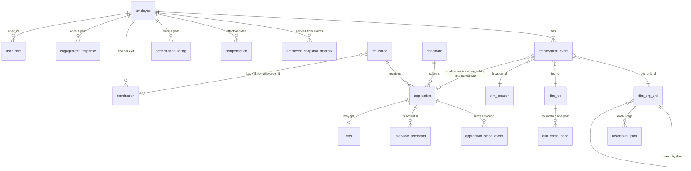

# Synthetic Talent Lifecycle Schema

The data model for layer 1. It covers Acme Corp, a fictional company, from **2021-01-01 to 2025-12-31**: recruiting funnel, hire, internal moves, promotions, leave, exit, pay, ratings, engagement, and who may see what.

Everything here is generated by `python -m people_ai.generate_data` from `src/people_ai/synthetic/`. It is deterministic: with `SEED = 42` you always get the same rows, and every number in this document refers to that seed. No real person is represented. Names come from Faker. Emails use `example.com` for candidates and `acme.example` for employees, and phone numbers use the fictional 555-01XX range.

## 1. Conventions that matter for every query

| Rule | What it means in SQL |
|---|---|
| **Events are truth** | `employment_event` is the source. An employee's state on date D is their latest event with `effective_date <= D`. `employee_snapshot_monthly` is only a month-end copy of that; tests prove they match row for row. |
| **Effective dating** | `valid_from` and `valid_to` are inclusive. An open-ended row has `valid_to = 9999-12-31`. Join on id **and** date, e.g. `on o.org_unit_id = e.org_unit_id and D between o.valid_from and o.valid_to`. |
| **Effective date = first day of the new state** | A `termination` dated D means the person is not employed on D; their last working day is D-1. Role intervals end on D-1 too. |
| **One event per employee per day** | If two changes land on one day they are merged into one row. The more important type wins (termination > hire/rehire > transfer > promotion > job_change/leave > manager_change), and the row holds the end-of-day state. |
| **Rehires keep their `employee_id`** | A boomerang's history is one timeline: hire … termination … rehire. `employee.original_hire_date` is the first hire, `most_recent_hire_date` the latest. |
| **Nothing exists after END** | Reqs still open, applications in process, and offers accepted with a 2026 start date stay that way. A person with an accepted offer is **not** an employee until their start date. At END: 174 open reqs, 802 applications in process, 74 accepted offers starting in 2026, 26 offers awaiting a decision. |
| **History before 2021 is collapsed** | The initial ~3,000 employees have one `hire` event (`event_reason = 'initial_load'`) at their real hire date, carrying their state as of 2021-01-01. Their comp row is dated the same way. Manager roles for them start on 2021-01-01. Only analyze dynamics from 2021 on. |
| **`application.candidate_type` is the truth about who applied** | `external`, `internal` (current employee) or `boomerang` (former employee). A candidate row can carry both `internal_employee_id` and `former_employee_id` if the same person applied in both situations over time. |

## 2. Entity map

## 3. Tables

Row counts are for SEED 42.

### Dimensions

**`dim_date`** (4,383 rows): one row per day from 2014-01-01 to 2025-12-31. Columns: `date`, `date_key` (yyyymmdd), `fiscal_year`, `fiscal_quarter` (fiscal = calendar), `month`, `day_of_week` (1 = Monday), `is_month_end`, `is_quarter_end`, `is_year_end`.

**`dim_org_unit`** (67 rows): one row per org unit **version**. Key: (`org_unit_id`, `valid_from`).

| column | meaning |
|---|---|
| `org_unit_id` | Stable id. The same id can have several versions when its parent changes. |
| `org_unit_name` | Unique name. |
| `parent_org_unit_id` | Parent during this version (NULL for the company). |
| `org_level` | 1 company, 2 division, 3 org, 4 team. |
| `valid_from`, `valid_to` | Version validity (inclusive). Original units start 2014-01-01. |

**`dim_location`** (8): `location_id`, `city`, `country`, `region` (AMER / EMEA / APAC), `cost_of_living_index`.

**`dim_job`** (91): `job_id`, `job_family`, `job_track`, `job_level`, `job_title`, `is_manager_role`.
- 10 families.
- Tracks:
  - `IC`: levels 3 to 7, Associate → Principal.
  - `M`: levels 6 to 9, Manager → Senior Manager → Director → VP.
  - `E`: the CEO, level 10.

**`dim_comp_band`** (3,640): one row per job × location × calendar year. Columns: `job_id`, `location_id`, `valid_from`, `valid_to`, `min_salary`, `mid_salary`, `max_salary`, `currency` (always USD).
- Mid rises 3.5% a year.
- 2024 adds a one-time market jump for Data (+12%) and Engineering (+6%).
- Min is 0.8 × mid and max is 1.2 × mid.

**`headcount_plan`** (266): `org_unit_id` (level 3), `quarter_end`, `fiscal_year`, `fiscal_quarter`, `planned_headcount`, `plan_version_date`.
- Planned on January 1.
- Re-planned on each reorg date for the remaining quarters, so compare against actuals using the org tree as of the quarter end.

### Recruiting (ATS)

**`requisition`** (4,738): one row per opening.

| column | meaning |
|---|---|
| `req_id` | Key. |
| `org_unit_id` | Hiring team (level 4). |
| `job_id`, `location_id` | The role and where it sits. Always an IC job. |
| `hiring_manager_employee_id`, `recruiter_employee_id` | As assigned when the req opened. Recruiters are in the Talent Acquisition team. |
| `headcount_type` | `new` (growth) or `backfill`. |
| `backfill_for_employee_id` | For backfills: the terminated employee being replaced. |
| `opened_date`, `approved_date`, `target_start_date` | Sourcing starts on `approved_date`. |
| `closed_date`, `close_reason` | `filled` (closed on offer acceptance), `cancelled_no_hire` (3 sourcing rounds without a hire), `cancelled_business_change`, `cancelled_hiring_freeze`. NULL means still open at END. |

**`candidate`** (187,360): one row per person in the ATS.
- Identity: `candidate_id`, `first_name`, `last_name`, `email`, `phone`.
- Profile: `location_id`, `years_experience`, `current_company`, `highest_degree`, `skills` (semicolon list).
- Links: `internal_employee_id`, `former_employee_id`.
- Other: `created_date`, `resume_text` (NULL, see section 9).
- About 19,800 candidates applied more than once.

**`application`** (215,061): one row per candidate × req.

| column | meaning |
|---|---|
| `application_id`, `candidate_id`, `req_id` | Keys. |
| `candidate_type` | `external`, `internal`, `boomerang`. |
| `source_channel` | `inbound`, `referral`, `sourced`, `agency`, `campus`, or `internal_mobility` for internal applicants. |
| `applied_date` | On or after the req's `approved_date`. |
| `current_stage`, `current_stage_date` | The last stage entered. |
| `final_disposition` | `hired`, `rejected`, `withdrawn`, `in_process` (only at END). |
| `disposition_date`, `disposition_reason` | Values: `rejected_at_<stage>`, `candidate_withdrew`, `declined_offer`, `position_filled`, `req_cancelled`, `not_selected`, `candidate_left_company`. NULL when hired. |

**`application_stage_event`** (361,091): one row per stage an application entered. Columns: `stage_event_id`, `application_id`, `stage`, `entered_date`, `exited_date`, `outcome`.
- Stages in order: `applied` (resume review) → `recruiter_screen` → `hiring_manager_screen` → `onsite` → `offer`.
- `outcome` values: `advance`, `reject`, `withdraw`; at the offer stage, `accept` or `decline`.
- A stage still open at END has NULL `exited_date` and `outcome`.

**`interview_scorecard`** (164,490): one row per interviewer per interview stage.
- Columns: `scorecard_id`, `application_id`, `stage`, `interviewer_employee_id`, `submitted_date`, `recommendation`, `feedback_text` (NULL).
- Who interviews:
  - Recruiter screen: the recruiter.
  - Hiring manager screen: the hiring manager.
  - Onsite: the hiring manager plus up to 3 team members.
- `recommendation` is one of `strong_yes`, `yes`, `no`, `strong_no`. It mostly agrees with the stage outcome, with deliberate disagreements.
- Interviewers are always active employees on `submitted_date`.

**`offer`** (5,565): one row per extended offer.

| column | meaning |
|---|---|
| `offer_id`, `application_id` | Keys. |
| `extended_date` | When the offer stage was entered. |
| `job_id`, `job_level`, `location_id`, `base_salary_offered` | Terms. |
| `decision`, `decision_date` | `accepted`, `declined`, or NULL if undecided at END. |
| `decline_reason` | `comp`, `competing_offer`, `role_scope`, `location`, `personal`, `left_company`. |
| `competing_offer_flag` | The candidate reported another offer. |
| `start_date` | Accepted offers only. If it is after END, the person never appears as an employee. |

### Employees (HRIS)

**`employee`** (6,518): one row per person ever employed. Columns: `employee_id`, `first_name`, `last_name`, `legal_name`, `work_email`, `original_hire_date`, `most_recent_hire_date`, `is_rehire`. There are no state columns here on purpose: state lives in events.

**`employment_event`** (14,965): the spine. One row per change, at most one per employee per day.

| column | meaning |
|---|---|
| `event_id` | Global chronological id. |
| `employee_id`, `effective_date` | Unique together. |
| `event_type` | `hire` 6,518 · `termination` 2,234 · `manager_change` 2,064 · `promotion` 1,626 · `transfer` 1,105 · `leave_start` 562 · `leave_return` 519 · `rehire` 206 · `job_change` 131. |
| `event_reason` | Values by type:  • hire: `initial_load` or NULL  • transfer: `lateral_move` or `internal_application`  • promotion: `cycle`, `succession`, `new_people_manager` or `reorg`  • manager_change: `manager_departed` or `reorg`  • termination: the exit reason |
| `org_unit_id`, `job_id`, `job_level`, `location_id`, `manager_employee_id`, `employment_status` | Full state **after** the event. Status is `active`, `leave` or `terminated`. |
| `application_id` | Set on hires, rehires and internal-application transfers. This is the join from HRIS back to the ATS. |

Every employee's first event is `hire`. After a `termination` the only possible next event is `rehire`, and `leave_return` only follows `leave`.

**`employee_snapshot_monthly`** (225,579): month-end state for everyone active or on leave. Columns: `snapshot_date`, `employee_id`, `org_unit_id`, `job_id`, `job_level`, `location_id`, `manager_employee_id`, `employment_status`, `tenure_months` (since most recent hire). Built in SQL from events (`export.py`). If it ever disagrees with events, the snapshot is wrong.

**`compensation`** (25,564): effective-dated pay, at most one row per employee per day. Columns: `employee_id`, `effective_date`, `base_salary`, `currency`, `bonus_target_pct`, `equity_grant_value`, `comp_change_reason`.
- `comp_change_reason` is one of `hire`, `rehire`, `merit` (every March 1), `promotion`, `transfer`, `relocation`, `job_change`.
- Current pay on date D is the latest row with `effective_date <= D`.
- **Compa-ratio** = that salary / `mid_salary` of the band valid on D for the employee's job and location on D.

**`performance_rating`** (36,404): `employee_id`, `cycle` (`2021H1` …), `rating_date` (June 30 or Dec 31), `rating` (1 to 5, roughly 3/12/55/22/8%), `calibrated_flag`, `manager_employee_id_at_cycle`. Only employees with at least 90 days of tenure are rated.

**`termination`** (2,234): one row per exit.

| column | meaning |
|---|---|
| `employee_id`, `termination_date` | Key. Matches a `termination` event. |
| `termination_type` | `voluntary` or `involuntary`. |
| `exit_reason` | Voluntary: `career_growth`, `comp`, `manager`, `relocation`, `personal`, `competing_offer`. Involuntary: `performance`, `misconduct`, `restructuring`, `reduction_in_force`. |
| `regretted_flag` | `voluntary` **and** `last_rating >= 4`. |
| `rehire_eligible` | Voluntary and `last_rating >= 3`. |
| `last_org_unit_id`, `last_job_id`, `last_job_level`, `last_manager_employee_id`, `last_rating` | State at exit. |
| `exit_interview_text` | NULL, see section 9. |

**`engagement_response`** (13,827): one row per respondent per annual survey (October 15, ~74% response). Columns: `response_id`, `survey_cycle`, `response_date`, `employee_id`, `org_unit_id`, `manager_employee_id`, `engagement_score`, `manager_score`, `growth_score` (1 to 5), `comment_theme`, `comment_sentiment`, `comment_text` (NULL).
- Individual responses must never be shown to anyone.
- Aggregates are suppressed below 5 respondents.

### Governance

**`user_role`** (801): effective-dated access grants. `user_id` is an `employee_id`.

| role | scope_type | scope_org_unit_id | granted when | intervals (open at END) |
|---|---|---|---|---|
| `manager` | `reporting_tree` | NULL (scope is people, not org) | the person has at least one direct report | 727 (493) |
| `hrbp` | `org_subtree` | a level-3 org | assigned from the HR Business Partners team, exactly one per org at all times | 32 (14) |
| `executive` | `aggregate_subtree` | a division, or the company for the CEO | holds the division VP or CEO position | 6 (5) |
| `people_analytics` | `all` | 1 | member of the People Analytics team | 36 (28) |

A role closes the day before the person leaves the position or the company, and reopens for the successor on that day. Roles are not suspended during leave.

**`demo_user`** (10): stable personas for tests and evals, all valid on 2025-12-31. Look personas up by name; ids are only stable for SEED 42.

| persona | user_id | use it to test |
|---|---|---|
| `people_analytics` | 453 | full access |
| `hrbp_ai_platform` | 3523 | HRBP scope on AI Platform (org 14), which lost two teams on 2024-09-01 |
| `executive_platform` | 4 | division-level aggregates only |
| `ceo` | 1 | company aggregates only |
| `manager_checkout_lead` | 617 | reporting tree that includes the S2 team |
| `manager_team_19_lead` | 25 | lead of the team moved in reorg 1 |
| `manager_small_team` | 2906 | a line manager with 3 to 4 reports (suppression below 5) |
| `former_manager` | 22 | managed people in 2021, then left and was rehired as an IC: access must be point-in-time |
| `ic_no_access` | 28 | no rights at all |
| `planted_bad_manager` | 618 | S2 (terminated, so not a valid user at END) |

## 4. Organization

- **Company:** Acme Corp (1).
- **Divisions:** Consumer (2), Enterprise (3), Platform (4), Corporate (5).
- **Orgs** (level 3):

| division | orgs |
|---|---|
| Consumer | Mobile 6, Growth 7, Payments 8 |
| Enterprise | Cloud Sales 9, Solutions 10, Partner 11 |
| Platform | Infrastructure 12, Data Platform 13, AI Platform 14, Security 15, and Applied AI 64 from 2024-09-01 |
| Corporate | People 16, Finance 17, Legal 18 |

- **Teams:** 45 teams with ids 19 to 63, in the order listed in `params.ORG_DESIGN`. For example: Checkout 27, Talent Acquisition 54, HR Business Partners 55, People Analytics 56.
- **Reorg 1 (2023-04-01):** team **19, App Experience**, moves from Mobile (6) to Growth (7). `headcount('2023-03-31', 19)` rolls up to Mobile; `headcount('2023-04-30', 19)` rolls up to Growth. Team members get no event, because their team didn't change; only the team lead gets a `manager_change` (`reorg`).
- **Reorg 2 (2024-09-01):** AI Platform is split.
  - A new org, **Applied AI (64)**, is created, and teams **Applied ML (49)** and **Evaluation (50)** move under it.
  - One of those teams' leads is promoted to director of Applied AI (`promotion`, reason `reorg`).
  - HRBP coverage and the headcount plan are re-based on that date.

**Management chain:** CEO → division VP (level 9) → org director (8) → team lead (7) → line managers (6) → ICs.
- Maximum depth is 5 hops, and the average span of control at END is 9.1.
- New hires go to the line manager with the fewest reports. When every line manager has 10, the best-rated eligible IC becomes a new line manager.
- When a manager leaves, the best-rated eligible direct report is promoted into the role (`succession`) and takes over the rest; if nobody fits, the reports move up a level.

## 5. Authorization rules (enforced in layer 3)

From PROJECT_PLAN:

| data class | manager | hrbp | executive | people_analytics |
|---|---|---|---|---|
| people (roster, events, headcount) | own reporting tree as of the date | org subtree as of the date | division subtree, aggregated below team level | all |
| compensation | individual rows for direct reports only; aggregates for the tree | individual rows in the subtree | aggregated | all |
| performance | individual rows for direct reports only | individual rows in the subtree | aggregated | all |
| engagement | aggregates only, suppressed < 5 respondents | same | same | same (never individual) |

**To decide in layer 3:** recruiting data is not covered by the plan yet. The proposed default:
- Hiring managers and recruiters see their own reqs and applicants.
- HRBPs see reqs in their org subtree.
- Executives see aggregates.
- people_analytics sees everything.
- Candidate contact details (email, phone) are visible to recruiters and people_analytics only.

## 6. Headline numbers (SEED 42)

Rates use average month-end active headcount for the year.

| year | active at year end | hires | rehires | internal moves | voluntary exits | involuntary exits | voluntary % | involuntary % | regretted share of voluntary |
|---|---|---|---|---|---|---|---|---|---|
| 2021 | 3,267 | 519 | 15 | 84 | 268 | 72 | 8.6 | 2.3 | 30.6% |
| 2022 | 3,747 | 811 | 49 | 126 | 322 | 63 | 9.2 | 1.8 | 29.5% |
| 2023 | 3,855 | 536 | 36 | 96 | 340 | 127 | 9.0 | 3.4 | 40.9% |
| 2024 | 4,113 | 765 | 46 | 109 | 447 | 96 | **11.3** | 2.4 | **34.5%** |
| 2025 | 4,462 | 785 | 60 | 115 | 396 | 103 | 9.2 | 2.4 | 37.1% |

Active headcount was 3,069 on 2021-01-31. Initial-load hire events are dated before 2021, so the hires column counts only real hires.

## 7. Planted signals: known answers for evals

These are deliberate, and `tests/test_planted_signals.py` keeps them from disappearing when the data is regenerated. The parameters live under PLANTED SIGNALS in `params.py`.

**S1: Platform attrition rose in 2024.** This is the answer to "why did attrition rise in Platform in 2024?"
- **The numbers:** Platform voluntary attrition was 7.6% in 2023, 13.7% in 2024 and 10.2% in 2025. In 2024 the other divisions were at 9.0–11.0%.
- **Driver 1, market pay:** the 2024 band jump left Data and Engineering underpaid.
  - Average compa-ratio on June 30 went from 1.00 to 0.91 for Data, and from 1.00 to 0.94 for Engineering. Sales stayed at 1.01.
  - Platform is mostly Data and Engineering. Consumer, which also employs many engineers, rose a little too (8.6% → 11.0%).
- **Driver 2, uncertainty:** extra flight risk in Platform from 2024-06-01 to 2025-03-31, around the AI Platform split (reorg 2).
- **Evidence in the data:**
  - Platform engagement fell from 3.73 (2023) to 3.22 (2024); other divisions stayed at about 3.7.
  - Growth scores dropped, and `comment_theme = 'reorg'` appears.
  - Exit reasons shift toward `competing_offer` and `comp`.

**S2: one bad manager.**
- **Who:** employee **618**, a line manager in Checkout (team 27).
- **Attrition:** their reports quit at a 65% annualized rate, against 9.5% company-wide, and 11 exits cite `manager`.
- **Engagement:** their average manager_score is 2.76, against 3.84 company-wide.
- **Outcome:** they were exited as involuntary / `performance` on 2025-07-15.

**S3: referrals convert and accept better.** External applicants, by source:

| source | passes resume review | accepts offer |
|---|---|---|
| referral | 55.9% | 81.3% |
| inbound | 26.4% | 72.5% |
| sourced | 42.2% | 68.6% |
| agency | 46.3% | 58.6% |
| campus | 28.2% | 70.0% |

**S4: location effects in hiring.**
- In Bangalore, 56.4% of declined offers cite `comp`, against 34.3% elsewhere.
- London reqs take a median 70 days from approval to fill, against 57 elsewhere.

**S5: pay and performance drive who leaves.**
- **Voluntary exits by last rating:** 1: 47 · 2: 194 · 3: 915 · 4: 433 · 5: 184. High performers are overrepresented, especially when below band.
- **Involuntary exits by last rating:** 1: 96 · 2: 161 · 3: 177 · 4: 24 · 5: 3. Ratings 1–2 are 56% of involuntary exits, against about 15% of the workforce.

**S6: hiring freeze.**
- On 2023-01-15, 124 open growth reqs were cancelled (`cancelled_hiring_freeze`).
- No growth reqs were opened from 2023-01-15 to 2023-03-31; backfills continued.

**S7: Enterprise restructuring.**
- On 2023-02-15, 56 Enterprise employees were exited with `exit_reason = 'reduction_in_force'`, weighted toward low ratings.
- None of them were backfilled.
- This is why involuntary attrition was 3.4% in 2023.

## 8. Known simplifications

- Everyone is full time. Pay is in USD. Bands change once a year.
- Lateral transfers and internal applications are for ICs only; people become managers only through succession or span growth.
- Growth reqs are opened to track a company headcount target, so hiring follows the growth assumptions in `params.GROWTH_BY_YEAR`.
- Recruiter and interviewer workloads are not capped.
- Engagement responses carry `employee_id` so authorization can be tested; a real survey vendor would not expose it.
- The pre-2021 history is collapsed (see section 1).

## 9. Text columns (optional LLM step, not yet in PROJECT_PLAN)

Four free-text columns are NULL today. Each sits next to structured ground truth, so text generated by an LLM from that truth can later be evaluated, for example: "does the classifier recover the theme we planted?"

| column | generate from | lets you practice |
|---|---|---|
| `candidate.resume_text` | skills, years_experience, current_company, highest_degree, the family of the jobs applied to | structured extraction, resume–job matching with embeddings, PII redaction, a few planted prompt-injection resumes |
| `interview_scorecard.feedback_text` | stage, recommendation, application outcome | summarization, checking that a summary agrees with the decision |
| `termination.exit_interview_text` | exit_reason, regretted_flag, last_rating | classification accuracy against `exit_reason` |
| `engagement_response.comment_text` | comment_theme, comment_sentiment (theme `none` means no comment) | theme and sentiment classification, suppression of small groups |

Natural next additions for retrieval (RAG) practice: a job posting per requisition, and a small set of policy documents (leveling guide, interview rubric, pay policy).
