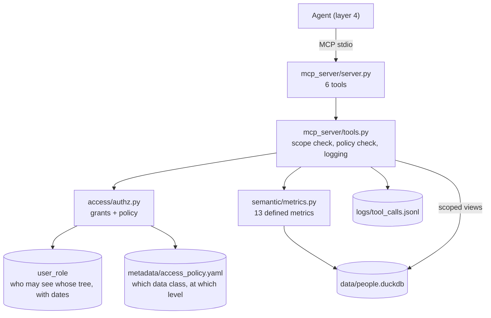

# Architecture: the governed door (layer 3)

Layer 3 is the only way an agent touches this data. It answers two questions before any row is returned, and
writes down what it did.



## Authorization is two questions, both from data

**Whose data?** `user_role` grants, valid on the date of the question. Each grant names a leader whose tree the
user may see: a manager their own tree, an HRBP the director's tree they cover, an executive their own tree,
people analytics everything. Because grants are effective dated, access is point-in-time: the `former_manager`
persona could see their team in 2021 and can see nothing today.

**Which data about them?** [`metadata/access_policy.yaml`](../metadata/access_policy.yaml), by data class, using
the sensitivity levels in `tables.yaml`. Floors are `individual`, `direct_reports`, `aggregate`, `none`.

| data class | manager | hrbp | executive | people_analytics |
|---|---|---|---|---|
| people | individual | individual | aggregate | individual |
| compensation | direct reports only | individual | aggregate | individual |
| performance | direct reports only | individual | aggregate | individual |
| engagement | aggregate | aggregate | aggregate | aggregate |
| recruiting | aggregate | individual | aggregate | individual |
| candidate contact details | none | none | none | individual |
| access control tables | none | none | none | individual |

People hold several roles at once and the most permissive floor wins. A VP has an executive grant over their
tree **and** a manager grant because they have direct reports, so they see their own organization's roster, pay
for the people reporting to them only, and engagement as suppressed aggregates.

Engagement and pay aggregates are suppressed below 5 people, and a caller cannot lower that: a request with
`min_respondents=1` is raised to the policy minimum and the answer says so.

## The tools

| tool | what it enforces |
|---|---|
| `list_metrics` | Definitions are public; data is not. Needs no access. |
| `get_definition` | Written definitions for metrics, tables and columns, so the agent never invents one. |
| `get_metric` | Scope check, data-class floor, suppression floor. Returns rows plus the definition, the scope used, and notes. |
| `describe_leader` | A leader, their chain above, the leaders below and headcount, inside the caller's scope. |
| `search_people` | Name and alias search, limited to people the caller may see; needs individual-level people access. |
| `run_readonly_sql` | The escape hatch, and the one to distrust. See below. |

**Refusals are errors, not empty results.** A manager asking about another organization gets "user 617 may not
see anichols's organization; their access covers imatthew", not zero rows. Silent emptiness would let someone
probe another team, and would teach the agent that the answer is zero.

## run_readonly_sql

The plan calls this the most dangerous tool, so it is built to be boring:

1. **A different database per caller.** The query runs on a fresh in-memory connection with the warehouse
   attached read-only as `source`. Only views the caller is allowed to see are created, already filtered to
   their scope. A manager's `compensation` view contains their direct reports; an HRBP's contains their whole
   tree; an executive gets no `compensation` view at all. Principle 2 of the plan, literally: the same table is
   a different table for a different role.
2. **One read-only statement.** Rejects anything that is not a single `SELECT`/`WITH`, any DDL or DML keyword,
   file and system functions, and schema-qualified names (so `source.compensation` can't be reached).
3. **Allowlist by name.** Tables referenced must be among the views built for that caller, with a message naming
   what is available. `engagement_response` is never exposed: survey data is only available through the metric,
   which applies suppression.
4. **Limits.** 1,000 rows by default with a `truncated` flag, and a 20-second timeout that interrupts the query.

## Logging

Every call appends one line to `logs/tool_calls.jsonl`: timestamp, tool, user, parameters, outcome
(`ok` / `denied` / `error`), rows returned, scope applied, latency, and the reason for a refusal. Denials are
logged as carefully as successes, because "who tried to see what" is the interesting half.

## Decisions worth knowing

- **Identity is a parameter.** Every tool takes `user_id`. In a deployment this comes from the transport's
  authentication; here it is explicit so a session can act as any demo persona. The server never infers identity
  from the conversation.
- **The agent never gets raw credentials or a raw connection.** The MCP server is the only path.
- **Metrics first, SQL second.** The server instructions tell the agent to prefer `get_metric` and use SQL only
  where no metric exists. When a metric doesn't exist, the honest answer is that it doesn't.
- **Not built yet:** rate limits, real authentication, log retention and rotation, and recruiting data at
  individual level for hiring managers on their own reqs (today recruiting rows need HRBP or people analytics).

## Running it

```bash
.venv/bin/python -m people_ai.mcp_server.server        # stdio
npx @modelcontextprotocol/inspector .venv/bin/python -m people_ai.mcp_server.server
```

`tests/test_mcp_server_stdio.py` starts the server, performs the MCP handshake, lists the tools and calls one,
so this path stays working without the inspector.
